# PRD — Model AI 1B dari Scratch (Zig, Semua Manual, Multimodal)

Versi 1.0 · 26 November 2026 · Status: draft siap implementasi

Perubahan dari v0.3: seluruh dokumen diperdetail dengan spesifikasi hardware, anggaran compute dan memori, konfigurasi model, rumus komponen, format berkas, hiperparameter titik awal, kriteria penerimaan per fitur, register risiko, milestone, strategi pengujian, keputusan terbuka, dan diagram tambahan.

Konvensi tanda di seluruh dokumen:
- **(asumsi)**: hitungan atau perkiraan penulis, belum terukur. Ukur sebelum dipercaya.
- **(verifikasi)**: berasal dari pengetahuan umum penulis; cek ke sumber primer sebelum dipakai.
- Tanpa tanda: berasal dari sumber riset yang disebut di 1.9.

---

## 1. Overview

### 1.1 Tujuan dan visi
Membangun model bahasa ±1B parameter dari nol **beserta seluruh mesinnya** dalam Zig: library tensor, autograd, kernel GPU (PTX dari Zig), tokenizer, pipeline data, training loop, evaluasi, dan inferensi. Arsitektur modern (hybrid Gated DeltaNet + attention, looping layer, memori lookup Engram, bobot ternary) dilatih di sumber daya gratis (Kaggle + GitHub Actions) dengan checkpoint yang tahan putus sesi.

Model akhirnya **multimodal**: memahami dan menghasilkan teks, gambar, audio, dan video. Karena batas compute, setiap modalitas non-teks dikerjakan dalam tier skala mikro. Targetnya bukti konsep yang bekerja dan bisa direproduksi, bukan kualitas setara model komersial.

Kriteria keberhasilan proyek:
1. Engine Zig benar secara numerik (lolos gradient check dan tes parity terhadap oracle).
2. Model teks terlatih sejauh anggaran memungkinkan dengan kurva loss sehat dan evaluasi jujur.
3. Kemampuan reasoning dasar terukur naik setelah tahap reasoning.
4. Setiap modalitas non-teks lulus minimal tier pertamanya.
5. Seluruh hasil bisa direproduksi dari repositori, konfigurasi, dan checkpoint.

### 1.2 Keputusan yang sudah dikunci

| Hal | Keputusan | Catatan |
|---|---|---|
| Bahasa implementasi | Zig 0.16.0 (pin versi tepat) | Zig belum 1.0; API bisa berubah antar versi |
| Prinsip | Semua komponen dibuat manual satu per satu | Aturan manual di 1.3 |
| Ukuran model | 1B parameter | Dicapai lewat tangga ukuran P0 → P1 → P2 → T (1.7) |
| Hardware | Kaggle 2×T4 gratis | GitHub Actions hanya untuk CI |
| Tokenizer | Custom (SuperBPE / BPE), trainer dan encoder ditulis di Zig | Gigatoken hanya pembanding; ukuran vocab diputuskan lewat eksperimen (D-01) |
| Data | Dicari sendiri oleh pemilik proyek | PRD mengatur pipeline, format, dan kontrol kualitas |
| Reasoning | Mid-training (thinking mid-training, RLP opsional) + SFT + RLVR singkat | Bukan sekadar SFT lalu RL |
| Teknik training | Muon, TST, jadwal WSD, muP/CompleteP | Semua diuji di proxy kecil dulu |
| Modalitas | Teks, gambar, audio, video; masing-masing dibaca dan dihasilkan | Bertahap per tier; urutan: teks → audio → gambar → video |
| Representasi media | Token diskret dari codec/tokenizer modalitas, masuk LM lewat embedding bersama | DiT/flow-matching hanya cadangan |
| Presisi | fp16 + loss scaling dinamis, master fp32 | T4 tanpa bf16 |

### 1.3 Aturan manual
- **Wajib Zig:** semua kode yang menyentuh tensor, model, training, data, tokenizer, evaluasi, checkpoint, dan inferensi.
- **Boleh bukan Zig:** skrip orkestrasi (shell, YAML CI, Kaggle CLI, unggah ke Hub), skrip glue konversi media (ffmpeg, decoder gambar), dan **PyTorch hanya sebagai oracle tes** (membuat data referensi, tidak ikut produk).
- **Boleh dibaca, tidak jadi dependensi:** Fucina (tensor/autograd Zig CPU), zgml, Zigrad, zig_cuda.
- **Pembanding benchmark (bukan dependensi):** Gigatoken, cuBLAS, HF tokenizers, lm-evaluation-harness.
- **Bobot pretrained** (mis. Mimi) dianggap data; kode inferensinya tetap Zig.

### 1.4 Batasan sumber daya

Spesifikasi hardware (verifikasi di M0 lewat query driver CUDA):

| Item | Nilai | Catatan |
|---|---|---|
| GPU | NVIDIA T4 ×2 (sm_75, Turing) | Dua GPU terpisah lewat PCIe; tidak ada NVLink (verifikasi) |
| Memori per GPU | 16 GB GDDR6, ±15 GB bisa dipakai | Bandwidth ±320 GB/s |
| SM / tensor core | 40 SM / 320 tensor core | |
| Puncak FP32 | ±8,1 TFLOPS | |
| Puncak FP16 tensor | ±65 TFLOPS per GPU, ±130 dua GPU | Nyata jauh lebih rendah: clock turun oleh batas daya 70 W |
| Puncak INT8 tensor | ±130 TOPS per GPU | Relevan untuk bobot W1.58 × aktivasi A8 |
| Titik impas roofline (tensor fp16) | ±200 FLOP per byte | Op di bawahnya terikat memori; fusi kernel wajib |
| Shared memory per SM | hingga 64 KB (verifikasi) | Menentukan ukuran tile |
| bf16 | Tidak ada | fp16 + loss scaling |
| `cp.async` | Tidak ada (mulai Ampere) | Muat global → shared lewat register (verifikasi) |
| Instruksi `mma` fp16 | `m16n8k8` (Turing) | `m16n8k16` baru Ampere (verifikasi PTX ISA) |

Batas platform:
- Kaggle: ±30 jam GPU per minggu, maksimal 12 jam per sesi, output `/kaggle/working` ±20 GB dengan batas ±500 file. Satu sumber (Nov 2026) menyebut P100 sudah dihentikan, jadi asumsikan 2×T4. **Cek di akun.**
- CPU Kaggle tanpa batas mingguan: dipakai untuk tokenizer, tokenisasi data, dedup, dan tes CPU.
- Zig GPU: backend NVPTX menghasilkan PTX dari kode Zig, tetapi barrier blok, warp shuffle, dan tensor core tidak punya builtin; semua lewat inline asm PTX.
- Kompilasi PTX bisa di laptop; **menjalankan** kernel hanya di Kaggle dan memakai kuota GPU.
- GitHub Actions: runner standar CPU, job maksimal 6 jam; ketentuan melarang pemakaian yang tidak berkaitan dengan proyek perangkat lunak. **Jangan dipakai untuk training.**

### 1.5 Anggaran compute teks (asumsi)

Penurunan:
- FLOPs model per token ≈ 6 × N dengan N = 1,07B → ±6,4 GFLOPs.
- Activation checkpointing menambah ±33% FLOPs hardware → ±8,5 GFLOPs per token.
- Throughput = utilisasi × 130 TFLOPS ÷ 8,5 GFLOPs ≈ utilisasi × 15,3 ribu token per detik.
- Kuota mingguan ±108.000 detik GPU (30 jam).

| Utilisasi tensor core (hardware) | Token per detik | Token per minggu | Minggu untuk 3 miliar token | Minggu untuk 10 miliar token |
|---|---|---|---|---|
| 30% | ±4,6 ribu | ±0,50 miliar | ±6 | ±20 |
| 20% | ±3,1 ribu | ±0,33 miliar | ±9 | ±30 |
| 10% | ±1,5 ribu | ±0,17 miliar | ±18 | ±60 |
| 5% | ±0,8 ribu | ±0,08 miliar | ±36 | ±120 |

Kernel tulisan tangan pertama kemungkinan berada di 5–15% (asumsi); cuBLAS pun tidak mencapai puncak di T4. Karena itu **ukuran akhir model dan token budget ditetapkan di gate G-SCALE** setelah utilisasi terukur (pengukuran awal di M5, keputusan final di M7). Aturan keputusan: pilih konfigurasi sehingga run utama ≤ ±26 minggu kuota; jika utilisasi terukur < 10%, turunkan ukuran (300–500M) atau kurangi token.

Proxy P2 (±55M, 1,4 miliar token): FLOPs per token ≈ 0,33 G → ±3,3 jam GPU pada 30% dan ±10 jam pada 10% per ablasi.

### 1.6 Anggaran memori 1B per GPU dengan ZeRO-1 (asumsi)

| Komponen | Hitungan | GB |
|---|---|---|
| Bobot fp16 (replika penuh) | 1,07B × 2 B | 2,14 |
| Akumulator gradien fp32 (shard 1/2; reduce-scatter per bucket saat backward) | 1,07B × 4 B ÷ 2 | 2,14 |
| Master fp32 (shard 1/2) | 1,07B × 4 B ÷ 2 | 2,14 |
| Momentum Muon fp32 (shard 1/2; matriks 2D ≈ 0,97B) | 0,97B × 4 B ÷ 2 | 1,94 |
| State AdamW embedding (m dan v fp32, shard 1/2) | 0,10B × 8 B ÷ 2 | 0,40 |
| Aktivasi batas blok (micro-batch 4 × 2048 token) | 24 × 4 × 2048 × 2048 × 2 B | 0,81 |
| Puncak recompute satu blok + workspace attention | perkiraan | ±1–2 |
| Logit per potongan (fused cross-entropy, 1024 token × V) | 1024 × 49152 × 4 B × 2 | ±0,4 |
| Buffer komunikasi + workspace kernel | perkiraan | ±1 |
| **Total** | | **±12–13** |

Tanpa ZeRO-1 (optimizer dan akumulator penuh di tiap GPU) total naik ±4,5 GB menjadi ±16,5–17,5 GB: **tidak muat**. Jadi sharding state optimizer adalah syarat, bukan optimasi.

### 1.7 Spesifikasi model target

Rancangan awal (hitung ulang dengan alat `param_count` di M1):

| Parameter | P0 debug | P1 | P2 proxy | T target |
|---|---|---|---|---|
| Total parameter | ≈1M | ≈7M | ≈55M | ≈1,07B |
| d_model | 128 | 256 | 512 | 2048 |
| Jumlah lapisan | 4 | 8 | 12 | 24 |
| Pola | 1 grup | 2 grup | 3 grup | 6 grup |
| Head attention / dim head / KV head | 2 / 64 / 1 | 4 / 64 / 1 | 8 / 64 / 2 | 16 / 128 / 4 |
| Head GDN (key / value) | 2 / 2 (dk 32, dv 64) | 2 / 4 (dk 64, dv 64) | 4 / 8 (dk 64, dv 64) | 8 / 16 (dk 128, dv 128) |
| Hidden MLP (ReLU²) | 384 | 768 | 1536 | 6144 |
| Vocab | 2K | 8K | 49,152 | 49,152 |
| Panjang konteks latih | 256 | 512 | 1024 | 2048 |

Aturan umum:
- **Satu grup = 3 lapisan GDN lalu 1 lapisan attention penuh** (rasio 3:1). Tiap lapisan = pra-norm RMSNorm + mixer + residual, lalu pra-norm + MLP + residual.
- Embedding terikat dengan kepala keluaran. P0 dan P1 memakai tokenizer kecil agar embedding tidak mendominasi.
- Rincian jumlah parameter T: lapisan GDN ≈ 41,95M × 18 = 755M; lapisan attention ≈ 35,66M × 6 = 214M; embedding ≈ 100,7M; total ≈ 1,07B.
- Tanpa bias di semua linear. Norm: RMSNorm, eps 1e-6.
- RoPE hanya di lapisan attention (θ awal 10.000, bisa dinaikkan untuk konteks panjang); lapisan GDN tidak memakai embedding posisi eksplisit.
- Inisialisasi: normal std 0,02 sebagai baseline; skema muP/CompleteP setelah diuji di proxy.

### 1.8 Kesenjangan compute multimodal

Rujukan publik, dikonversi kasar ke kuota Kaggle (±60 jam T4 per minggu dari 2 GPU):

| Rujukan | Biaya yang dilaporkan | Konversi kasar |
|---|---|---|
| MicroDiT (text-to-image 512px, 1,16B sparse, 37M gambar) | 2,6 hari × 8 H100 (±500 jam H100) | ±125 minggu kuota |
| Video diffusion 2B (H3AE) | 128 A100 × 4–10 hari (±12–31 ribu jam A100) | ±1.000–2.500 minggu kuota |
| E-MMDiT (304M, 25M gambar) | 1,5 hari × 8 MI300X | tidak dikonversi (GPU berbeda) |
| NanoCodec (codec audio) | 48 A100, 196 ribu langkah | training codec dari nol tidak realistis |

Konversi memakai rasio puncak FLOPs fp16 (H100 ≈ 15× T4, A100 ≈ 5× T4) dan **optimis**, karena utilisasi nyata T4 dan kernel buatan sendiri lebih buruk. Kesimpulan: skala rujukan itu mustahil di sini.

Konsekuensi desain:
- **Tier mikro:** gambar 64×64 lalu 128×128; video 64×64 dengan 9–17 frame; audio ucapan 24 kHz. Dataset kecil dengan banyak data sintetis.
- **Tokenizer/codec modalitas tidak dilatih dari nol** bila ada bobot pretrained berlisensi jelas.
- **Memahami jauh lebih murah dari menghasilkan.** Urutan kerja: paham dulu, hasilkan kemudian.
- Teknik hemat: resolusi bertahap, masking patch tinggi saat training (75% di MicroDiT), kompresi VAE video tinggi (mis. 32×32×8 di LTX-Video), attention linear untuk urutan panjang (SANA-Video).
- 1 juta pasangan gambar–teks ≈ 300 juta token ≈ ±0,6 minggu kuota pada utilisasi 30% di model 1B (asumsi); pada 10% sekitar tiga kali lebih lama.

### 1.9 Dasar riset

Sumber yang sudah dibaca (angka dan rumus di PRD ini berasal dari sini kecuali bertanda asumsi/verifikasi):
- **Zig GPU:** backend NVPTX (PTX dari Zig); zig_cuda (binding CUDA Driver API murni Zig, kernel `sm_75`); catatan "Zig and GPUs"; fork std.gpu (eksperimen, bukan mainline).
- **Zig ML referensi:** Fucina (Zig 0.16, CPU-first, tensor/autograd + inferensi LLM), zgml, Zigrad.
- **Arsitektur:** Gated Delta Networks (arXiv 2412.06464, ICLR 2025); Qwen3-Next / Qwen3.5 (hybrid GDN + attention 3:1, MoE, MTP); Kimi Linear.
- **Engram (DeepSeek, arXiv 2601.07372):** lookup n-gram hashed O(1), multi-head hashing, gating sadar konteks; V4.1 (arXiv 2609.19969); Tensorizing Engram (arXiv 2606.08347).
- **Bobot ringan:** BitNet b1.58 2B4T (arXiv 2504.12285); BitNet Distillation (arXiv 2510.13998); "When are 1.58 bits enough?" (arXiv 2411.05882).
- **Optimizer:** Muon (Keller Jordan; Moonlight/Moonshot untuk penskalaan RMS), dokumentasi `torch.optim.Muon`, "Fantastic Pretraining Optimizers" (arXiv 2509.02046).
- **Training:** TST (arXiv 2605.06546), WSD (arXiv 2410.05192), CompleteP (arXiv 2512.22382), resep nanoGPT speedrun.
- **Memori:** Titans, Nested Learning/Hope (eksperimental). **Looping:** Ouro, Mixture-of-Recursions, Parcae.
- **Tokenizer:** SuperBPE (arXiv 2503.13423), Faster Superword Tokenization (arXiv 2604.05192), Gigatoken (github.com/marcelroed/gigatoken).
- **Reasoning:** RLP (arXiv 2510.01265), Thinking Mid-training (Meta), Phi-4-Mini-Reasoning (arXiv 2504.21233).
- **Evaluasi:** Signal and Noise (arXiv 2508.13144), DataDecide (Ai2).
- **Audio:** Mimi/Moshi (Kyutai; 24 kHz → 12,5 Hz, 8 codebook RVQ, 1,1 kbps, bobot CC-BY, dilatih pada ucapan), Llama-Mimi (arXiv 2509.14882), NanoCodec (arXiv 2508.05835).
- **Gambar:** MicroDiT (arXiv 2407.15811), E-MMDiT (arXiv 2510.27135), Fast Training with Masked Transformers (arXiv 2306.09305).
- **Video:** MagViT-v2 / progressive video tokenizers (arXiv 2501.05442), CogVideoX, LTX-Video (arXiv 2501.00103), SANA-Video (arXiv 2509.24695), H3AE (arXiv 2504.10567).
- **Multimodal terpadu:** Toward Native Multimodal Modeling (arXiv 2605.25343), AR-Omni (arXiv 2601.17761), Apertus 1.5 (arXiv 2610.15542), Emu3.5.

### 1.10 Register risiko

| ID | Risiko | Dampak | Kemungkinan | Mitigasi | Pemicu / gate |
|---|---|---|---|---|---|
| R-01 | Utilisasi GPU kernel buatan sendiri jauh di bawah estimasi | Tinggi | Tinggi | Ukur di M5 dan M7; ukuran/token budget ditetapkan di G-SCALE; kernel matmul bertahap sampai tensor core | Utilisasi < 10% |
| R-02 | Bug numerik diam-diam (loss turun tapi salah) | Tinggi | Sedang | Gradient check f64 wajib, parity terhadap oracle, tes golden | Parity gagal |
| R-03 | Zig berubah (pre-1.0) | Sedang | Sedang | Pin 0.16.0; jangan upgrade di tengah fase; CI mengunci versi | Build rusak |
| R-04 | Tensor core T4 lewat inline PTX sulit di-debug | Tinggi | Sedang | Mulai naif, bandingkan tiap langkah ke CPU; uji `mma` di kernel kecil dulu | Parity GPU gagal |
| R-05 | Kuota Kaggle berubah atau akun dibatasi | Tinggi | Rendah | Cadangan checkpoint di Hub; jangan pakai banyak akun (melanggar ketentuan) | Kebijakan baru |
| R-06 | Checkpoint 1B tidak muat dua salinan di 20 GB | Sedang | Tinggi | Momentum fp16, ping-pong, unggah-lalu-hapus (3.4) | Disk penuh |
| R-07 | Sesi mati di tengah penulisan checkpoint | Sedang | Tinggi | Protokol atomik + COMMIT marker; loader hanya menerima yang committed | Berkas rusak |
| R-08 | Loss spike / NaN di fp16 | Sedang | Sedang | Loss scaling dinamis, clipping, rollback otomatis, QK-Norm, z-loss opsional | Grad norm melonjak |
| R-09 | Kombinasi teknik baru tidak sinergis (hybrid + looping + Engram + ternary + TST) | Tinggi | Sedang | Ablation ladder; buang yang gagal gate | Gate ablasi |
| R-10 | BitNet butuh QAT dari awal; overhead belum terukur | Sedang | Sedang | Ukur di proxy; eksperimen INT8 `mma` | Overhead > 30% |
| R-11 | Muon di fp16 belum teruji | Sedang | Sedang | Newton–Schulz dijalankan fp32 jika fp16 tidak stabil | Orthogonalitas rusak |
| R-12 | GDN backward chunked sangat kompleks | Tinggi | Tinggi | Mulai rekuren (benar, lambat); chunked belakangan; gradcheck di keduanya | Waktu implementasi |
| R-13 | RLP: kode referensi belum tersedia atau terlalu mahal | Sedang | Sedang | Jalur cadangan thinking mid-training + SFT | Kode tidak ada |
| R-14 | Lisensi data, bobot codec/tokenizer, dan model guru | Tinggi | Sedang | Catat lisensi per sumber di metadata; cek sebelum pakai | Lisensi tak jelas |
| R-15 | Metrik standar multimodal butuh jaringan pretrained | Rendah | Tinggi | Metrik pengganti (3.11) | |
| R-16 | Cakupan multimodal terlalu besar | Tinggi | Tinggi | Tier mikro; urutan audio → gambar → video; naik tier hanya bila lulus | Gate tier |
| R-17 | Data multimodal melebihi 20 GB | Sedang | Tinggi | Simpan token, bukan media mentah | Disk penuh |
| R-18 | Beban engineering engine menghabiskan energi proyek | Tinggi | Tinggi | Milestone kecil dengan kriteria keluar (2.5); hasil antara selalu bisa dipakai | Milestone molor |

### 1.11 Non-goals (versi ini)
Kualitas setara model komersial di modalitas apa pun, resolusi tinggi (>256px), video panjang (>beberapa detik), musik/suara umum kualitas tinggi, serving produksi, dukungan GPU selain NVIDIA sm_75, fine-tuning model pihak ketiga, antarmuka pengguna.

### 1.12 Glosarium

| Istilah | Arti |
|---|---|
| GDN | Gated DeltaNet: linear attention dengan aturan delta ber-gate |
| WSD | Warmup–Stable–Decay: jadwal learning rate tanpa durasi tetap |
| TST | Token-Superposition Training: fase awal dengan bag beberapa token |
| muP / CompleteP | Skema parameterisasi agar hyperparameter dari proxy kecil bisa ditransfer |
| ZeRO-1 | Sharding state optimizer di antara GPU |
| MFU / utilisasi | Rasio FLOPs terpakai terhadap puncak hardware |
| BPB | Bits-per-byte: loss yang tidak bergantung tokenizer |
| Oracle | Implementasi referensi (PyTorch) hanya untuk membuat data tes |
| Parity | Hasil dua implementasi cocok dalam toleransi |
| Gate | Syarat terukur untuk lanjut ke fase berikutnya |
| Tier | Tingkat cakupan modalitas (resolusi/durasi) |

---

## 2. Requirement

### 2.1 Functional

Prioritas: P0 wajib, P1 penting, P2 opsional/eksperimen.

| ID | Requirement | Prio | Kriteria penerimaan |
|---|---|---|---|
| FR-01 | Library tensor: dtype f32/f16/i8/ternary2, view/stride, allocator arena/pool | P0 | Tes view tanpa salin; semua dtype round-trip benar |
| FR-02 | Kernel CPU (SIMD + multithread) untuk semua op model | P0 | Tes golden lolos; matmul mencapai target persentase puncak CPU yang ditetapkan setelah diukur |
| FR-03 | Autograd reverse-mode dengan gradient check | P0 | Gradient check f64 untuk semua op, galat relatif < 1e-6 |
| FR-04 | Optimizer AdamW dan Muon | P0 | 100 langkah cocok oracle dalam toleransi (2.6) |
| FR-05 | Backend GPU: kernel Zig → PTX sm_75 via Driver API | P0 | Parity CPU↔GPU di semua kernel dalam toleransi fp16 |
| FR-06 | Kernel attention kausal gaya flash (GQA, forward + backward) | P0 | Parity terhadap attention naif; memori O(N) |
| FR-07 | Kernel GDN: rekuren (P0) dan chunked (P1) | P0/P1 | Rekuren = chunked dalam toleransi; gradcheck lolos |
| FR-08 | Mixed precision fp16 + loss scaling dinamis, master fp32 | P0 | Tidak ada NaN di 1.000 langkah proxy; skip-step saat overflow |
| FR-09 | Data-parallel 2 GPU + sharding optimizer ZeRO-1 | P0 | Loss 2 GPU = 1 GPU (token sama) dalam toleransi; model 1B muat |
| FR-10 | Checkpoint dan resume deterministik | P0 | Loss langkah n+1 setelah resume sama dengan run tanpa henti (bit-identik di CPU, dalam toleransi di GPU) |
| FR-11 | Watchdog sesi dan penyimpanan otomatis | P0 | Sesi dihentikan paksa di uji; kehilangan ≤ 1 interval |
| FR-12 | Trainer tokenizer BPE dan SuperBPE | P0 | Kesetaraan dengan oracle untuk BPE baseline |
| FR-13 | Encoder/decoder tokenizer cepat | P0 | Round-trip tanpa kehilangan; throughput terukur vs Gigatoken |
| FR-14 | Pipeline data: filter → dedup → tokenisasi → shard → mix | P0 | Resume sampler persis; tidak ada kebocoran validasi |
| FR-15 | Arsitektur modular dan config tunggal | P0 | Tiap komponen bisa dinyalakan; param_count cocok rancangan |
| FR-16 | Jadwal WSD, TST, dan hyperparameter via muP/CompleteP | P0/P1 | Transfer dari P2 ke 300M terverifikasi |
| FR-17 | Runner evaluasi BPB dan benchmark pilihan ganda | P0 | Cocok harness standar pada satu model referensi |
| FR-18 | Observabilitas dan alat debug (3.21) | P0 | Log lengkap; deteksi spike berfungsi |
| FR-19 | Engram (lookup n-gram, tabel di RAM) | P1 | Lulus gate ablasi; prefetch tidak memblokir GPU |
| FR-20 | Bobot ternary (BitLinear) dengan QAT | P1 | Lulus gate ablasi; ekspor ternary terpak |
| FR-21 | Looping layer dengan early-exit | P2 | Lulus gate ablasi |
| FR-22 | Multi-token prediction | P2 | Lulus gate ablasi; speedup decoding terukur |
| FR-23 | Pipeline reasoning (mid-training, SFT, RLVR, RLP opsional) | P1 | Skor reasoning naik vs sebelum tahap |
| FR-24 | Inferensi forward-only dengan cache state dan sampling | P0 | Logit sama dengan forward training dalam toleransi |
| FR-25 | CI GitHub Actions | P0 | Build, tes CPU, gradcheck, round-trip checkpoint hijau |
| FR-26 | Op konvolusi 1D/2D/3D, transposed conv, GroupNorm | P1 | Gradient check lolos; parity GPU |
| FR-27 | Vocab terpadu multimodal + token pembatas | P1 | Tidak ada tabrakan id; round-trip lolos |
| FR-28 | Audio: paham (ASR, QA) dan hasilkan (TTS, lanjutan) via Mimi | P1 | Gate tier A1 (2.3) |
| FR-29 | Gambar: paham dan hasilkan | P2 | Gate tier I1 → I2 |
| FR-30 | Video: paham dan hasilkan klip pendek | P2 | Gate tier V1 |
| FR-31 | Dekoder modalitas di Zig | P1 | Rekonstruksi di atas ambang |
| FR-32 | Pipeline tokenisasi media offline | P1 | Shard token + metadata lisensi |
| FR-33 | Evaluasi multimodal dengan metrik tanpa jaringan eksternal | P2 | Metrik pengganti terdokumentasi dan terhitung |

### 2.2 Non-functional

| Aspek | Persyaratan |
|---|---|
| Kebenaran numerik | Tiap op punya tes golden dan gradient check; tolerance di 2.6 |
| Determinisme | Seed, versi Zig, dan config tersimpan per run; reduksi CPU berurutan tetap; reduksi GPU tanpa atomics (dua-pass) bila dibutuhkan untuk tes bit-identik |
| Keandalan | Kehilangan data maksimal 1 interval checkpoint; checkpoint rusak tidak pernah dimuat (COMMIT marker + hash) |
| Hemat kuota | Tidak ada GPU idle; pekerjaan CPU di CPU; suite tes GPU berjalan sekali per sesi pendek |
| Portabilitas format | Bobot kompatibel safetensors; data token uint16/uint32 memmap |
| Keterbacaan | Satu modul per berkas besar, kontrak publik terdokumentasi, tidak ada op tanpa tes |
| Kinerja | Target diukur, bukan ditebak: tiap kernel punya benchmark dengan persen puncak |
| Lisensi dan data | Metadata lisensi per sumber data/bobot; tidak memakai data/bobot berlisensi tak jelas |
| Keamanan | Tidak menyimpan token API di repositori; rahasia lewat variabel lingkungan/secret |

### 2.3 Metrik sukses dan gate

| Fase | Metrik | Gate lulus |
|---|---|---|
| Engine CPU | Gradient check; parity model P0 | Semua op lolos; kurva loss P0 cocok oracle, selisih maksimum ≤ 2e-3 selama 200 langkah (asumsi) |
| Backend GPU | Parity CPU vs GPU; throughput | Parity lolos; utilisasi tercatat per kernel (G-SCALE) |
| Checkpoint | Uji stop/resume | Loss kontinu; uji mati paksa lolos 10 kali berturut-turut |
| Tokenizer | Kesetaraan oracle; bytes/token | BPE baseline identik dengan oracle; kandidat terbaik terpilih |
| Proxy ablation | BPB pada token sama, dua seed | Adopsi jika BPB membaik ≥ 0,5% dan selisih > 2× galat baku, atau memori/throughput membaik ≥ 20% dengan BPB memburuk ≤ 0,5% (ambang bisa disesuaikan) |
| Scale 1B | Kurva loss, throughput | Loss turun stabil tanpa spike tak pulih; throughput dalam ±30% hasil ukur G-SCALE |
| Reasoning | Akurasi set tertahan | Naik dibanding checkpoint sebelum tahap |
| Fondasi multimodal | Rekonstruksi dan round-trip | Gradient check konvolusi lolos; PSNR (gambar/video) dan SI-SDR (audio) di atas ambang yang ditetapkan setelah baseline |
| Audio A1 | WER ASR; WER round-trip TTS | WER di bawah baseline yang ditetapkan |
| Gambar I1 → I2 | Caption/VQA; classifier kecil | Di atas acak dan baseline |
| Video V1 | Selisih antar-frame; classifier gerak | Konsistensi temporal wajar pada data sintetis |
| Final | Perbandingan dengan model open sebanding | Dilaporkan jujur di benchmark yang sama |

Catatan evaluasi: metrik utama BPB (agnostik tokenizer). MMLU dan ARC-Easy cukup prediktif dari model kecil; ARC-Challenge terlalu berisik. Ambang multimodal ditetapkan setelah baseline diukur di M12.

### 2.4 Asumsi dan dependensi
- Pemilik proyek menyediakan korpus teks, data reasoning, dan data multimodal dengan lisensi jelas.
- Model guru untuk trace reasoning: lisensi output dicek dulu.
- Notebook Kaggle bisa mengunduh toolchain Zig dan menaut `libcuda` (**diverifikasi di M0**).
- Ada mesin lokal untuk menulis dan menguji kode CPU; GPU hanya via Kaggle.
- Skrip glue (ffmpeg/decoder gambar, unggah Hub) boleh non-Zig.
- Akun Hugging Face tersedia untuk cadangan checkpoint; kuota penyimpanannya dicek.

### 2.5 Milestone dan kriteria keluar

Usaha relatif: S (hari), M (minggu), L (bulan), XL (beberapa bulan); ini perkiraan kasar (asumsi).

| ID | Milestone | Deliverable | Kriteria keluar | Bergantung pada | Usaha |
|---|---|---|---|---|---|
| M0 | Verifikasi lingkungan | Zig + libcuda di Kaggle, `vector_add` PTX jalan, query spesifikasi GPU | Kernel contoh benar; spesifikasi tercatat | — | S |
| M1 | Engine CPU | Tensor, kernel CPU, autograd, AdamW, lapisan dasar | Gradcheck + parity P0 | M0 | L |
| M2 | Tokenizer | Trainer BPE/SuperBPE, encoder, tes oracle | Gate tokenizer | M1 (parsial) | M |
| M3 | Pipeline data | Filter, dedup, shard, sampler | Resume sampler persis | M2 | M |
| M4 | Backend GPU dasar | Binding Driver API, elementwise, reduksi, matmul naif/tiled | Parity CPU↔GPU | M1 | L |
| M5 | Training GPU end-to-end | Model P1 terlatih di GPU, fp16 + loss scaling | Loss mengikuti CPU; tanpa NaN | M3, M4 | M |
| M6 | Checkpoint dan watchdog | Format, atomik, Hub sync, resume | Gate checkpoint | M5 | M |
| M7 | Kernel lanjut + multi-GPU | Matmul tensor core, attention, GDN, DP + ZeRO-1 | Gate backend; G-SCALE | M6 | XL |
| M8 | Proxy P2 + muP | Baseline P2, hyperparameter terukur | Kurva baseline stabil | M7 | M |
| M9 | Ablation ladder | Keputusan adopsi tiap komponen | Gate ablasi | M8 | L |
| M10 | Run 1B | Pretraining stable | Gate scale | M9 | XL |
| M11 | Decay + reasoning | Mid-training, SFT, RLVR | Gate reasoning | M10 | L |
| M12 | Multimodal fondasi + audio | Konv ops, vocab terpadu, Mimi paham/hasilkan | Gate fondasi + A1 | M11 | XL |
| M13 | Gambar | Tokenizer gambar, paham/hasilkan | Gate I1 → I2 | M12 | L |
| M14 | Video | Tokenizer 3D, paham/hasilkan | Gate V1 | M13 | XL |

Hasil antara selalu usable: setelah M5 sudah ada mesin training kecil yang bekerja; setelah M9 sudah ada model proxy terbaik.

### 2.6 Strategi pengujian

| Level | Tujuan | Alat | Dijalankan di |
|---|---|---|---|
| Unit | Op tunggal benar | `zig test` | Lokal, CI |
| Gradient check | Backward benar | Finite difference f64 | Lokal, CI |
| Golden | Cocok oracle | Biner referensi dari PyTorch (dikomit) | Lokal, CI |
| Parity CPU↔GPU | Kernel benar | Suite tes GPU satu sesi | Kaggle |
| Integrasi | Pipeline end-to-end | Run P0/P1 pendek | CI (CPU), Kaggle (GPU) |
| Regresi kinerja | Tidak melambat | Benchmark tersimpan per kernel | Kaggle |
| Mati paksa | Checkpoint tahan gagal | Penghentian acak saat training | Lokal, Kaggle |

Toleransi awal (asumsi, disesuaikan setelah diukur):

| Perbandingan | Toleransi |
|---|---|
| Gradient check f64 | galat relatif < 1e-6 |
| Op f32 vs oracle f32 | galat relatif < 1e-5 |
| Kernel GPU fp16 vs CPU f32 | galat relatif < 1e-2 dan absolut < 1e-3 |
| Loss P0 200 langkah vs oracle | selisih maksimum ≤ 2e-3 |
| Resume vs tanpa henti | CPU bit-identik; GPU dalam toleransi fp16 |

### 2.7 Keputusan terbuka

| ID | Keputusan | Opsi | Diputuskan di |
|---|---|---|---|
| D-01 | Ukuran vocab dan algoritma tokenizer | BPE vs SuperBPE; 32.768 / 49.152 / 65.536 | M2 + M8 |
| D-02 | Ukuran final model dan token budget | 300M / 500M / 1B; 2–10 miliar token | G-SCALE (M7) |
| D-03 | Pakai bobot ternary atau tidak | Ternary vs fp16 | M9 |
| D-04 | Jumlah putaran looping | 1 / 2 / 4, tetap vs adaptif | M9 |
| D-05 | Ukuran tabel Engram | 2^16–2^20 entri per head | M9 |
| D-06 | Jumlah codebook audio | 4 vs 8 | M12 |
| D-07 | Skema parameterisasi | Standar vs muP vs CompleteP | M8 |
| D-08 | Tokenizer gambar/video | Port pretrained vs VQ-VAE sendiri | M13 |
| D-09 | Panjang konteks latih | 1024 / 2048 / 4096 | M8 |
| D-10 | Pakai MoE atau tidak | Dense vs sparse | M9 (opsional) |

---

## 3. Core Features

### 3.1 Engine Inti: Tensor dan Kernel CPU

**Ide**
Fondasi: tipe tensor, manajemen memori, dan kernel CPU yang benar dan cepat. Semua fitur lain bertumpu di sini, dan kernel CPU juga jadi oracle internal untuk kernel GPU.

**Spesifikasi**
- `Tensor`: penunjuk data, `dtype`, `ndim` ≤ 5, `shape[5]`, `strides[5]` (dalam elemen), `offset`, `device` (cpu/gpu), penanda kepemilikan. View membagi data tanpa salin. Rank 5 dibutuhkan konvolusi video (N, C, T, H, W).
- Dtype: f32, f16 (binary16), i8, u8, i32, u16/u32 (id token), dan `ternary2` (2 bit terpak, 4 nilai per byte; rancangan: 00 = 0, 01 = +1, 10 = −1).
- Konversi f32↔f16 dengan pembulatan ke terdekat-genap; tangani subnormal dan overflow (→ inf) secara eksplisit.
- Alokator: `StepArena` (direset tiap langkah training), `Pool` (kelas ukuran pangkat dua), `PinnedHost` (untuk transfer cepat ke GPU), `DevicePool`.
- Matmul CPU bertahap: naif → blocked (MC/NC/KC disetel) → micro-kernel SIMD dengan `@Vector` (panjang dari `std.simd.suggestVectorLength`) → multithread. Akumulasi selalu f32 walau input f16.
- Numerik: softmax stabil (kurangi maksimum), log-sum-exp untuk cross-entropy, RMSNorm dengan rsqrt di f32, reduksi dalam urutan tetap.
- RNG: xoshiro256** dengan seed lewat splitmix64; normal lewat Box–Muller. Seed tiap tensor = hash(seed global, nama tensor) agar urutan pembuatan tidak memengaruhi hasil.
- Thread pool sendiri di atas `std.Thread` dengan partisi statis agar urutan reduksi deterministik.
- Format tukar tensor dengan oracle: header (dtype, ndim, shape) lalu byte mentah little-endian.

**Tasklist**
- [ ] T3.1-01 `Tensor` + view + stride + penegak batas rank
- [ ] T3.1-02 Dtype dan konversi (f32↔f16, int8, ternary2 pack/unpack)
- [ ] T3.1-03 Alokator: StepArena, Pool, PinnedHost, DevicePool
- [ ] T3.1-04 Elementwise: add, mul, scale, ReLU², SiLU, sigmoid, softplus, exp, log
- [ ] T3.1-05 Reduksi: sum, max, mean, norm L2
- [ ] T3.1-06 Softmax, log-sum-exp, cross-entropy (fused, per potongan)
- [ ] T3.1-07 RMSNorm (forward saja dulu; backward di 3.2)
- [ ] T3.1-08 Embedding gather dan scatter-add
- [ ] T3.1-09 Matmul: naif → blocked → SIMD → multithread
- [ ] T3.1-10 RNG, inisialisasi parameter, hash nama tensor
- [ ] T3.1-11 Thread pool dengan partisi statis
- [ ] T3.1-12 Format tukar tensor oracle + pemuat
- [ ] T3.1-13 Harness golden dan harness benchmark (GFLOPS, GB/s)
- [ ] T3.1-14 Alat `param_count` dari config

**Cara membuat**
1. Pin Zig 0.16.0 di `build.zig.zon` dan CI.
2. Mulai f32 CPU saja. Tulis `Tensor` + view, lalu op satu per satu; tiap op mendapat spesifikasi (input, output, toleransi) sebelum kode.
3. Matmul bertahap: versi naif yang benar, ukur, lalu blocked, SIMD, multithread; catat GFLOPS tiap tahap dan bandingkan dengan puncak teoritis CPU dari benchmark FMA sederhana.
4. Buat data referensi dari PyTorch sekali per op (biner kecil, dikomit) dan tes golden otomatis.
5. Baca Fucina dan zgml untuk desain, jangan disalin mentah.

**Kriteria selesai**
Semua op T3.1 lolos golden; matmul mencapai persentase puncak CPU yang ditetapkan setelah pengukuran awal; `param_count` cocok tabel 1.7.

### 3.2 Autograd, Lapisan, dan Optimizer

**Ide**
Reverse-mode autodiff sendiri, ditopang gradient check otomatis. Kebenaran lebih penting dari kecepatan di tahap ini.

**Spesifikasi**
- Tape: daftar node (op, input, output, tensor tersimpan, fungsi backward) yang direset tiap langkah di arena. Op primitif ditulis generik atas tipe float (`comptime T`) agar bisa dijalankan di f64 untuk gradient check.
- Gradient check: perbandingan analitik vs finite difference f64 (eps ≈ 1e-5), galat relatif < 1e-6.
- Lapisan: Linear (tanpa bias), Embedding, RMSNorm, RoPE, attention kausal (GQA + QK-Norm), MLP ReLU², cross-entropy, konvolusi depthwise kausal pendek (untuk GDN), GDN (3.7).
- Optimizer **AdamW** untuk embedding, norm, dan skalar; **Muon** untuk matriks 2D di lapisan tersembunyi.
- **Muon** (sumber: dokumentasi `torch.optim.Muon`, Moonlight, Fantastic Pretraining Optimizers): untuk gradien g, buffer B ← μB + g (μ = 0,95); dengan Nesterov, Ĝ = g + μB. Normalisasi X ← Ĝ ÷ (norma Frobenius + eps). Jika baris > kolom, transpos. Lima iterasi: A = X Xᵀ; Bm = b·A + c·A²; X ← a·X + Bm·X dengan (a, b, c) = (3,4445; −4,7750; 2,0315). Transpos balik. Skala pembaruan: "original" = √max(1, baris/kolom) atau "match RMS AdamW" = 0,2·√max(baris, kolom). Pembaruan: θ ← θ − lr·skala·O − lr·λ·θ (weight decay terpisah).
- Newton–Schulz di fp16: fp16 punya mantissa lebih panjang dari bf16 dan nilai sudah dinormalisasi sehingga seharusnya aman dari overflow, tapi tetap diuji; cadangan: jalankan di fp32 (R-11).
- Loss scaling dinamis (kebiasaan GradScaler; verifikasi): skala awal 65.536, ×2 setelah 2.000 langkah tanpa overflow, ×0,5 dan lewati langkah saat ditemukan inf/nan.
- Clipping norma global 1,0, dihitung di fp32 setelah unscale.
- Protokol parity: P0 dengan bobot awal dimuat dari oracle, data sama, 200 langkah; bandingkan kurva loss.

**Tasklist**
- [ ] T3.2-01 Tape/graph + arena + alur backward
- [ ] T3.2-02 Backward untuk semua primitif T3.1 (elementwise, softmax, RMSNorm, embedding, matmul, cross-entropy)
- [ ] T3.2-03 Gradient check otomatis f64 per op (CLI)
- [ ] T3.2-04 Lapisan: Linear, Embedding, RMSNorm, RoPE, attention kausal GQA, MLP ReLU²
- [ ] T3.2-05 Konvolusi depthwise kausal pendek
- [ ] T3.2-06 AdamW (parameter group, weight decay terpisah)
- [ ] T3.2-07 Muon (Newton–Schulz, skala, Nesterov) + uji ortogonalitas
- [ ] T3.2-08 Loss scaling dinamis + deteksi overflow + skip-step
- [ ] T3.2-09 Clipping norma global
- [ ] T3.2-10 Parity run P0 vs oracle
- [ ] T3.2-11 Fusi kernel (cross-entropy + softmax) setelah versi tak fusi benar

**Cara membuat**
1. Tiap op tiga bagian: forward, backward, tes finite-difference. Tidak ada op tanpa gradient check.
2. Naik bertahap: MLP pada data sintetis → bigram → transformer mini P0 → bandingkan kurva loss dengan oracle.
3. Muon: tulis Newton–Schulz dengan matmul; uji bahwa nilai singular hasilnya mendekati 1 untuk matriks acak.
4. Uji loss scaling dengan menyuntikkan overflow buatan.
5. Fusi kernel hanya setelah ada baseline tak fusi untuk dibandingkan.

**Kriteria selesai**
Gradient check semua op lolos; P0 cocok oracle dalam toleransi; Muon dan AdamW cocok oracle selama 100 langkah.

### 3.3 Backend GPU: Kernel Zig → PTX

**Ide**
Kernel ditulis dalam Zig, dikompilasi ke PTX lewat backend NVPTX (target `sm_75`), dimuat lewat CUDA Driver API. Tanpa cuBLAS di produk.

**Spesifikasi**
- Build: target `nvptx64-cuda` dengan CPU `sm_75`, keluaran PTX; resep rinci mengikuti zig_cuda (sintaks atribut kernel dan address space bergantung versi Zig; cek di M0). Muat modul dengan `cuModuleLoadData`; cache JIT driver diaktifkan.
- Tanpa builtin untuk `bar.sync`, `shfl.sync`, `mma`, `ldmatrix`, indeks thread (`%tid.x` dan sejenisnya): semuanya inline asm PTX.
- Matmul tensor core di Turing: instruksi `mma.sync.aligned.m16n8k8` fp16 (akumulasi f32), pemuatan fragmen dengan `ldmatrix` (verifikasi PTX ISA). Karena tidak ada `cp.async`, pemuatan global → shared lewat register dengan double buffering manual.
- Rancangan tile awal matmul (disetel): blok 128×128×32, tile warp 64×64, 8 warp per blok; padding/swizzle shared memory untuk menghindari bank conflict; shared memory ≤ 48 KB per blok.
- Attention gaya flash: tiling Q×K dengan softmax online; tile Br = Bc = 64 dan dim head 128 → Q, K, V masing-masing 16 KB di shared (48 KB total). Backward dengan recompute (dQ, dK, dV). GQA: beberapa head Q berbagi satu KV.
- Reduksi tanpa atomics (dua-pass) agar deterministik.
- Transfer: memori host terpaku, stream terpisah untuk salinan host↔device, event CUDA untuk pengukuran waktu.
- Roofline: op elementwise dan norm terikat memori (±320 GB/s) sehingga harus difusi (mis. RMSNorm + residual, RoPE + QK-Norm, bias-free MLP + ReLU²).

Katalog kernel (urutan pengerjaan):

| Kernel | Strategi | Terikat oleh | Tes |
|---|---|---|---|
| Elementwise | Vektorisasi 128-bit, grid-stride | Bandwidth | Parity CPU |
| Reduksi (sum/max/norm) | Warp shuffle + shared, dua-pass | Bandwidth | Parity CPU, determinisme |
| Softmax / cross-entropy | Per baris, fused, per potongan vocab | Bandwidth | Parity CPU |
| RMSNorm (+ residual) | Fused, satu baris per warp/blok | Bandwidth | Parity CPU |
| Embedding gather / scatter-add | Scatter dengan urutan terurut agar deterministik | Bandwidth | Parity CPU |
| Matmul naif | Satu thread per elemen | Compute (rendah) | Parity CPU |
| Matmul tiled shared | Tile shared-memory | Compute | Parity CPU |
| Matmul tensor core | `mma.m16n8k8`, `ldmatrix`, double buffer | Compute / smem | Parity, GFLOPS vs puncak |
| Attention flash fwd/bwd | Tile 64×64, softmax online | Compute / smem | Parity attention naif |
| GDN rekuren | State di register/shared per head | Latensi | Parity CPU rekuren |
| GDN chunked | Segitiga C×C + matmul tensor core | Compute | Parity rekuren |
| Konvolusi 1D/2D/3D | im2col + matmul dulu, lalu langsung | Compute | Parity CPU |
| Optimizer (AdamW, Muon NS) | Elementwise + matmul NS | Bandwidth / compute | Parity CPU |

**Tasklist**
- [ ] T3.3-01 Binding CUDA Driver API (init, context, modul, stream, event, memori, transfer)
- [ ] T3.3-02 Alokator device + pool + pinned host
- [ ] T3.3-03 Kernel elementwise, reduksi, softmax/CE, RMSNorm, embedding
- [ ] T3.3-04 Matmul naif → tiled shared
- [ ] T3.3-05 Matmul tensor core (`mma.m16n8k8`, `ldmatrix`, double buffer)
- [ ] T3.3-06 Attention flash forward + backward (GQA, kausal, doc masking)
- [ ] T3.3-07 Kernel GDN rekuren, lalu chunked
- [ ] T3.3-08 Kernel optimizer (AdamW; matmul untuk Newton–Schulz)
- [ ] T3.3-09 Profiler berbasis event + benchmark persen puncak per kernel
- [ ] T3.3-10 Suite tes parity GPU satu sesi (≤ 10 menit)
- [ ] T3.3-11 Jalur INT8 `mma` (m8n8k16) untuk W1.58A8 (eksperimen)

**Cara membuat**
1. M0: pastikan Zig + libcuda jalan di Kaggle dan `vector_add` benar.
2. Kembangkan di laptop (kompilasi PTX saja). Kumpulkan tes lalu jalankan semuanya dalam satu sesi Kaggle singkat untuk hemat kuota.
3. Urutan: elementwise → reduksi → softmax/CE → norm → matmul naif → tiled → tensor core → attention → GDN. Tiap langkah dicek parity terhadap CPU.
4. Ukur persentase dari puncak T4 per kernel; catat di `KERNEL_BENCH` (5.1). Jangan pakai angka estimasi untuk memutuskan.
5. cuBLAS hanya untuk pembanding benchmark.

**Kriteria selesai**
Semua kernel di katalog lolos parity; benchmark tercatat; utilisasi matmul dan seluruh langkah training terukur (masukan untuk G-SCALE).

### 3.4 Sistem Checkpoint dan Resume

**Ide**
Training berminggu-minggu di sesi 12 jam butuh sistem yang menganggap sesi mati itu normal.

**Spesifikasi**
- **Isi checkpoint penuh:** bobot (safetensors), master fp32, state optimizer, scheduler (step, LR), skala loss, state RNG (4 × u64 per aliran), posisi data, `meta.json`, `config.yaml`.
- **Format safetensors** (ditulis manual): 8 byte panjang header (u64 little-endian), lalu JSON header (nama tensor → dtype, shape, `data_offsets`; `__metadata__` opsional), lalu data mentah.
- **State optimizer:** berkas biner sendiri: magic 8 byte, versi u32, jumlah entri, lalu per entri (panjang nama, nama, dtype, shape, offset). Momentum Muon boleh disimpan fp16 untuk menghemat ruang (lihat anggaran).
- **Posisi data tanpa state:** urutan shard dan offset diturunkan dari (seed, langkah global, indeks rank, indeks micro-batch), sehingga resume cukup tahu langkah.
- **Protokol atomik:** (1) tulis semua berkas ke `ckpt-<step>.tmp/`; (2) `fsync` tiap berkas dan direktori; (3) tulis `COMMIT` terakhir berisi sha256 `meta.json`; (4) `rename` ke `ckpt-<step>/`; (5) perbarui penunjuk `latest` lewat tulis-sementara + rename. Pemuat hanya menerima direktori ber-`COMMIT` dengan hash valid.
- **Anggaran ruang 20 GB (asumsi):**

| Komponen | Ukuran | Catatan |
|---|---|---|
| Bobot fp16 (ekspor) | 2,14 GB | Sekali per snapshot |
| Master fp32 | 4,28 GB | Wajib untuk resume |
| Momentum Muon fp16 | 1,94 GB | fp32 = 3,88 GB |
| State AdamW embedding fp32 | 0,80 GB | |
| **Checkpoint penuh (momentum fp16)** | **≈ 9,0 GB** | |

  Dua checkpoint penuh = ±18 GB: terlalu mepet. Kebijakan: simpan **satu** checkpoint penuh lokal; sebelum menulis yang baru, unggah yang lama ke Hub dan verifikasi, baru hapus lokal (unggah-lalu-hapus). Snapshot bobot fp16 disimpan maksimal 2 buah. Jika unggah gagal, jangan hapus.
- **Kebijakan waktu:** interval berbasis waktu (default tiap 30 menit) plus penyimpanan akhir sesi. Pada langkah ±1–3 menit (1B), 30 menit ≈ 10–30 langkah.
- **Watchdog:** jam sesi dimulai saat proses mulai. Pada jam ke-11 menit 30: berhenti menerima langkah baru, simpan, unggah, keluar. Batas keras jam ke-11 menit 50. Tangani SIGTERM juga.
- **Resume:** unduh checkpoint terakhir bila lokal kosong → verifikasi COMMIT dan hash → muat state → lanjutkan dari langkah tersimpan.
- **Deteksi spike dan rollback:** lihat 3.8 dan 4.13.

**Tasklist**
- [ ] T3.4-01 Penulis/pembaca safetensors
- [ ] T3.4-02 Format state optimizer dan RNG
- [ ] T3.4-03 Protokol atomik (tmp → fsync → COMMIT → rename → latest)
- [ ] T3.4-04 Pemuat yang menolak checkpoint tanpa COMMIT/hash
- [ ] T3.4-05 Sampler tanpa state (resume dari langkah)
- [ ] T3.4-06 Watchdog + penanganan SIGTERM
- [ ] T3.4-07 Skrip glue: unggah ke Hub, verifikasi, hapus lokal; unduh saat resume
- [ ] T3.4-08 Kebijakan retensi + penghitung ruang disk
- [ ] T3.4-09 Uji mati paksa acak (≥ 10 kali berturut-turut lolos)
- [ ] T3.4-10 Tes round-trip di CI (model P0)

**Cara membuat**
1. Mulai dari safetensors untuk bobot; ekspor yang sama dipakai inferensi.
2. Tulis protokol atomik dan uji dengan menghentikan proses di tiap titik tulis.
3. Sampler tanpa state: fungsi murni (seed, langkah, rank, micro) → daftar (shard, offset).
4. Uji akhir: 100 langkah, hentikan paksa acak, resume, bandingkan loss langkah berikutnya dengan run tanpa henti.

**Kriteria selesai**
Uji mati paksa lolos 10 kali berturut-turut; resume menghasilkan loss yang sama (bit-identik CPU, dalam toleransi GPU).

### 3.5 Tokenizer Custom (Zig)

**Ide**
Vocab custom yang lebih efisien (SuperBPE), trainer dan encoder ditulis sendiri. Gigatoken dipakai sebagai target kecepatan dan pembanding kebenaran. Gigatoken hanya encoder, bukan pelatih vocab.

**Spesifikasi**
- **Vocab dasar:** 256 byte (tokenisasi level-byte; tidak ada token tak dikenal). ID khusus dicadangkan di awal (0–63).
- **Token khusus:** `bos`, `eos`, `pad`, `fim_prefix`, `fim_middle`, `fim_suffix`, `think_open`, `think_close`, pembatas modalitas (`img`, `aud`, `vid`, `frame`) dan ruang cadangan.
- **Pra-tokenisasi:** mesin keadaan tulisan tangan (tanpa regex): kelompok huruf (termasuk non-ASCII UTF-8 diperlakukan sebagai huruf), angka dipotong maksimal 3 digit, tanda baca, spasi/baris baru; spasi awal menempel ke kata berikutnya.
- **Trainer BPE:** hitung frekuensi pra-token unik; tiap pra-token = urutan id; peta frekuensi pasangan + indeks terbalik pasangan → daftar pra-token; heap maksimum dengan pembaruan malas; tiap merge hanya memperbarui pra-token yang memuat pasangan itu.
- **SuperBPE (dua tahap):** tahap 1 BPE biasa dengan pra-tokenisasi spasi sampai titik transisi t; tahap 2 melepas batasan spasi dan meneruskan merge sehingga muncul token superword. Titik transisi disapu: t ∈ {50%, 70%, 90%} dari ukuran vocab.
- **Encoder:** per pra-token, merge berdasarkan peringkat terendah dengan daftar berantai; tabel hash kunci (id1, id2) → (peringkat, id baru); cache pra-token → id; paralel per berkas.
- **Kompresi tokenizer untuk Engram:** peta id → id kanonik (huruf besar/kecil, variasi spasi) yang menurunkan ukuran vocab modul memori ±23% pada paper Engram.
- **Berkas vocab:** biner sendiri: magic, versi, ukuran vocab, tabel byte per token, daftar merge (pasangan id), hash sha256 untuk dikunci.
- **Pembanding:** bytes/token dan loss model P1 per kandidat; kesetaraan dengan oracle untuk BPE baseline; throughput vs Gigatoken pada korpus yang sama.

**Tasklist**
- [ ] T3.5-01 Pra-tokenizer (mesin keadaan) + tes pada kasus UTF-8 dan angka
- [ ] T3.5-02 Trainer BPE baseline (32K, 49K, 65K)
- [ ] T3.5-03 Trainer SuperBPE dua tahap + sapuan titik transisi
- [ ] T3.5-04 Encoder dengan cache dan paralelisme
- [ ] T3.5-05 Decoder (id → byte) + tes round-trip tanpa kehilangan
- [ ] T3.5-06 Tes kesetaraan terhadap oracle (BPE baseline)
- [ ] T3.5-07 Ukur bytes/token, distribusi panjang, dan loss P1 per kandidat
- [ ] T3.5-08 Peta kompresi Engram
- [ ] T3.5-09 Benchmark throughput vs Gigatoken
- [ ] T3.5-10 Kunci tokenizer (versi + hash) dan tokenisasi korpus ke shard

**Cara membuat**
1. Jalankan di Kaggle CPU pada subset latih 1–2 GB. Jangan di GitHub Actions.
2. Tulis trainer BPE yang benar dulu; optimalkan setelah lolos tes oracle.
3. Tambahkan SuperBPE; bandingkan dengan baseline pada bytes/token dan loss P1 dengan token budget sama.
4. Jalankan `gigatoken validate` pada tokenizer kandidat; jika aturan pra-tokenisasi SuperBPE tidak didukung, pakai encoder Zig sendiri untuk SuperBPE.
5. Putuskan (D-01) sebelum Engram dan sebelum tokenisasi korpus penuh.

**Kriteria selesai**
Round-trip tanpa kehilangan; BPE baseline identik dengan oracle; kandidat terpilih dan terkunci.

### 3.6 Pipeline Data

**Ide**
Data dikumpulkan pemilik proyek; sistem memastikan data bersih, termuat cepat, dan bisa dilanjutkan posisinya.

**Spesifikasi**
- **Format sumber:** JSONL dengan `text`, `source`, `license`; konversi Parquet lewat skrip glue bila perlu.
- **Filter kualitas** (aturan gaya Gopher/C4, ambang disetel): panjang minimum dokumen, rasio simbol terhadap kata, rata-rata panjang kata, fraksi baris berakhir tanda baca, ambang pengulangan n-gram.
- **Dedup:** exact (hash 64-bit teks ternormalisasi) lalu near-dup (MinHash dari shingle 5-gram kata, 128 hash, LSH 16 pita × 8 baris ≈ ambang kemiripan 0,7; titik awal, verifikasi).
- **Dekontaminasi:** buang dokumen yang berbagi n-gram 13-kata dengan set evaluasi.
- **Split:** validasi tertahan per domain (±20 juta token total, asumsi) tanpa kebocoran.
- **Format shard token** (`ZTOK`): header (magic, versi, dtype u16/u32, jumlah token u64, ukuran vocab, sha256 tokenizer), lalu token little-endian. `eos` memisahkan dokumen. Ukuran shard ±100 juta token (≈200 MB di u16).
- **Batas dokumen:** attention kausal dalam dokumen; **state GDN direset di batas dokumen** (varlen).
- **Campuran awal (titik awal, disetel di proxy):** web 60–70%, kode 15–20%, matematika 5–10%; fase decay menambah data terbaik dan reasoning. Rasio disimpan di `mix.yaml` per fase.
- **Sampler deterministik:** (seed, langkah, rank, micro) → (shard, offset); tanpa state.

**Tasklist**
- [ ] T3.6-01 Pembaca JSONL streaming + validasi skema
- [ ] T3.6-02 Alat `filter` (aturan kualitas + log alasan buang)
- [ ] T3.6-03 Alat `dedup` (exact + MinHash/LSH)
- [ ] T3.6-04 Alat `decontaminate`
- [ ] T3.6-05 Alat `shard` (tokenisasi + tulis ZTOK + hash)
- [ ] T3.6-06 Alat `mix` + `mix.yaml` per fase
- [ ] T3.6-07 Sampler deterministik + tes resume
- [ ] T3.6-08 Split validasi tanpa kebocoran + laporan statistik per sumber
- [ ] T3.6-09 Unggah shard sebagai Kaggle Dataset privat (cek batas ukuran dataset)

**Cara membuat**
1. Satu alat Zig per langkah, masing-masing bisa dijalankan dan diuji sendiri.
2. Jalankan di CPU Kaggle; simpan statistik (jumlah dokumen/token masuk-keluar per langkah) untuk tiap sumber.
3. Karena model kecil sensitif terhadap noise data, utamakan kualitas daripada kuantitas.
4. Catat lisensi per sumber di metadata dan di laporan statistik.

**Kriteria selesai**
Pipeline menghasilkan shard berhash; sampler resume persis; validasi tidak bocor; laporan statistik tersedia.

### 3.7 Arsitektur Model Modular

**Ide**
Satu codebase dengan komponen yang bisa dinyalakan/dimatikan, diuji satu per satu di proxy P2 sebelum masuk 1B. Tiap komponen butuh forward dan backward manual (CPU dulu, lalu GPU).

**Spesifikasi**

*Susunan:* embedding → N grup × [GDN, GDN, GDN, Attention] → RMSNorm akhir → kepala terikat. Tiap lapisan: x ← x + Mixer(RMSNorm(x)); x ← x + MLP(RMSNorm(x)).

*Attention penuh:* GQA (Q: h head; K, V: g head), RoPE, QK-Norm (RMSNorm pada q dan k per head), kausal, mask dokumen.

*MLP:* ReLU²: y = W2 · relu(W1 x)². Tanpa bias.

*GDN (aturan dari paper, ICLR 2025):*
```text
S_t = S_{t-1} * alpha_t * (I - beta_t * k_t k_t^T) + beta_t * v_t k_t^T      S dalam R^(dv x dk)
o_t = S_t q_t
```
- alpha_t ∈ (0,1) gerbang peluruhan, beta_t ∈ (0,1) laju belajar delta. alpha_t = 0 menghapus memori; alpha_t = 1 menjadi aturan delta murni.
- Rincian praktik (verifikasi ke Qwen3-Next/flash-linear-attention sebelum final): konvolusi depthwise kausal pendek (kernel 4) + SiLU pada q, k, v; normalisasi L2 pada q dan k per head; beta = sigmoid(W_b x); alpha = exp(g) dengan g negatif dari parameter peluruhan gaya Mamba2; gerbang keluaran SiLU(W_g x) setelah RMSNorm per head; head value lebih banyak dari head key (grouped value).
- State direset ke nol di batas dokumen.

*GDN chunkwise (chunk C = 64; sumber: paper GDN dan DeltaNet):* bagi urutan jadi chunk; di tiap chunk, hitung peluruhan kumulatif γ_i dan Γ_ij = γ_i/γ_j untuk i ≥ j; transformasi UT memberi T = [I + strictLower(diag(β)(Γ ⊙ K Kᵀ))]⁻¹ (sistem segitiga C×C); dari situ diperoleh W dan Ũ (representasi WY), lalu
```text
V~   = U~ - W * S^T
O    = diag(gamma) * Q * S^T + (Q K^T ⊙ Gamma) * V~
S'   = gamma_C * S + (diag(gamma_C / gamma) * K)^T * V~
```
Implementasi bertahap: (1) rekuren per token (benar, lambat) sebagai referensi; (2) chunked setelah rekuren lolos gradcheck; keduanya harus saling cocok.

*Looping (rancangan, D-04):* struktur prelude–inti–coda: lapisan awal dan akhir tidak diulang; grup tengah diulang r kali dengan bobot dibagi dan embedding putaran ditambahkan. Eksperimen awal r ∈ {1, 2}; keluar dini lewat gerbang yang dipelajari setelah r tetap terbukti membantu (referensi: Ouro, Mixture-of-Recursions).

*Engram (sumber: arXiv 2601.07372):*
- Disisipkan di lapisan awal dan tengah (paper: lapisan 2 dan 15 pada 30 lapisan; pada T 24 lapisan: lapisan 2 dan ±12).
- Kunci: n-gram urutan 2 dan 3 dari id yang sudah dikompresi; **multi-head hashing** (paper: 8 head), tiap head punya tabel ber-ukuran prima berbeda dan fungsi hash perkalian-XOR deterministik; vektor dari semua head dan orde digabung.
- **Gerbang sadar konteks:** kunci k dan nilai v diproyeksikan dari vektor memori; α = RMSNorm(h)ᵀ·RMSNorm(k) ÷ √d; g = σ(sign(α)·√max(|α|, ε)); keluaran = g·v ditambahkan ke residual.
- Konvolusi depthwise kausal pendek setelah gerbang memberi manfaat marginal (V4.1 menghilangkannya); lewati di versi awal.
- Alamat deterministik memungkinkan **prefetch dari RAM host** sebelum lapisan itu dihitung.
- Ukuran awal (D-05, asumsi): 2 orde × 8 head = 16 tabel × 2^18 entri × 32 dimensi fp16 ≈ 268 MB per modul; naikkan hanya bila terbukti membantu. Embedding tabel diperbarui dengan AdamW (jarang/sparse).

*BitLinear (sumber: BitNet b1.58 2B4T):* bobot per tensor: γ = rata-rata nilai mutlak; w̃ = RoundClip(w ÷ (γ + ε), −1, +1). Aktivasi per token: kuantisasi absmax ke int8 [−127, 127]. RMSNorm (subln) sebelum kuantisasi, tanpa bias, ReLU² di FFN. Bobot master presisi tinggi (fp32 di sini; BitNet memakai bf16), gradien lewat straight-through estimator. Embedding dan kepala tidak dikuantisasi. Jalur eksperimen: matmul W1.58A8 dengan `mma` INT8 di Turing (verifikasi dan ukur sebelum memutuskan). Inferensi memakai bobot ternary terpak (2 bit per bobot).

*MTP (rancangan, opsional):* satu kepala tambahan memprediksi token t+2 memakai blok transformer kecil dan embedding bersama; bobot loss awal 0,3 (titik awal, disetel); dipakai juga sebagai draft untuk speculative decoding.

*MoE:* di luar cakupan awal (D-10).

**Tasklist**
- [ ] T3.7-01 Baseline dense: attention GQA + RoPE + QK-Norm + MLP ReLU² + RMSNorm
- [ ] T3.7-02 Config tunggal + registri komponen + `param_count`
- [ ] T3.7-03 GDN rekuren (forward + backward) + gradcheck
- [ ] T3.7-04 GDN chunked (forward + backward) + kecocokan dengan rekuren
- [ ] T3.7-05 Mask dokumen (attention) dan reset state (GDN)
- [ ] T3.7-06 Engram: kompresi, multi-head hashing, tabel, gerbang, prefetch
- [ ] T3.7-07 BitLinear + QAT (STE) + ekspor ternary terpak
- [ ] T3.7-08 Looping (prelude–inti–coda) dengan embedding putaran
- [ ] T3.7-09 Kepala MTP
- [ ] T3.7-10 Uji kesetaraan ekspor/inferensi vs training

**Cara membuat**
1. Baseline dulu; reproduksi kurva loss oracle pada ukuran kecil.
2. Tambahkan satu komponen per eksperimen; token, seed, dan hyperparameter sama.
3. Urutan ablasi: baseline → + hybrid GDN → + TST → + looping → + Engram → + ternary → + MTP. Yang gagal gate dibuang.
4. GDN: rekuren dulu; chunked hanya setelah rekuren benar. Turunkan backward chunked dengan recompute dalam chunk.
5. Engram: mulai tabel kecil (2^16) di P2; naikkan bila membantu.
6. Ternary: ukur overhead QAT dan uji jalur INT8 sebelum memutuskan D-03.

**Kriteria selesai**
Tiap komponen punya tes parity/gradcheck, entri di config, dan hasil ablasi tercatat (adopsi atau buang).

### 3.8 Training Cepat dan Hemat Memori

**Ide**
Memaksimalkan token per jam GPU di 2×T4 tanpa mengorbankan stabilitas, dengan semua infrastruktur paralel dibuat sendiri.

**Spesifikasi**

Hiperparameter titik awal (belum dituning; sweep di proxy, lihat protokol di bawah):

| Hal | P2 (±55M) | T (±1,07B) | Catatan |
|---|---|---|---|
| Panjang konteks | 1024 | 2048 | D-09 |
| Batch global | 65.536 token | 262.144 token | T: 4 seq × akumulasi 16 × 2 GPU = 128 seq |
| Langkah untuk 1,4B (P2) / 3B (T) token | ±21 ribu | ±11 ribu | 10B token T ≈ 38 ribu langkah |
| Optimizer | Muon (matriks 2D) + AdamW | sama | 3.2 |
| LR | disapu | disapu | Contoh dokumentasi PyTorch: Muon 0,02, AdamW 3e-4, sebagai titik tengah sapuan |
| Momentum Muon | 0,95, Nesterov | sama | |
| Weight decay | 0,1 | 0,1 | BitNet 2B4T menonaktifkannya di tahap kedua |
| Warmup | 1–2% langkah | 1–2% | |
| WSD | stable lalu decay 10–20% terakhir | sama | LR turun ke ≈ 0–10% puncak |
| Clipping | norma global 1,0 | sama | |
| TST | 30% awal token, bag 4 | sama | Lalu next-token biasa 70% |
| Skala loss | awal 65.536, ×2 per 2.000 langkah, ×0,5 saat overflow | sama | Kebiasaan GradScaler (verifikasi) |
| z-loss logit | opsional 1e-4 | opsional | Stabilisasi |

Protokol sapuan LR di P2: grid logaritmik 4–5 titik untuk Muon dan AdamW terpisah, tiap titik 1–2 seed, token budget penuh; pilih terbaik; transfer ke 300M/1B dengan aturan muP/CompleteP dan verifikasi lewat run pendek di ukuran menengah.

**Paralelisme (2 GPU, ZeRO-1):**
1. Setiap GPU menyimpan replika bobot fp16 penuh dan menjalankan forward/backward pada micro-batch sendiri.
2. Selama backward, gradien per bucket (mis. per lapisan) di-**reduce-scatter** ke akumulator fp32 milik shard masing-masing, lalu buffer dibebaskan; ini menggantikan replika gradien penuh (1.6).
3. Setelah semua micro-batch: masing-masing GPU memperbarui shard-nya (master fp32, Muon/AdamW), mengonversi ke fp16, lalu **all-gather** bobot.
4. Newton–Schulz Muon bekerja per matriks utuh: tetapkan matriks ke satu GPU pemilik (bukan memotong di tengah matriks).
5. Komunikasi: reduce-scatter per micro-batch ±1 GB per arah; pada ±6 GB/s via host (asumsi) ≈ 0,2 detik; ×16 micro-batch ≈ 3 detik per langkah dibanding ±57–175 detik per langkah komputasi. Bisa di-overlap dengan backward. Mulai dengan salin ke host (benar, sederhana); P2P bila tersedia; overlap belakangan.

**Aktivasi:** simpan hanya input blok (checkpointing per blok); recompute blok saat backward; GDN: simpan state per chunk dan recompute di dalam chunk; attention flash: recompute statistik softmax. Cross-entropy diproses per potongan token supaya logit penuh tidak pernah dimaterialisasi.

**Kebijakan loss spike (asumsi):** spike jika loss > rata-rata bergerak + 5 simpangan baku, atau norma gradien > 10× rata-rata bergerak. Spike tunggal: lewati pembaruan dan catat. Tiga spike dalam 50 langkah: rollback ke checkpoint terakhir, turunkan LR setengah selama 200 langkah, lalu naik lagi.

**Presisi per tensor:**

| Tensor | Dtype |
|---|---|
| Bobot master, state optimizer (momentum bisa fp16 di checkpoint) | fp32 |
| Bobot forward/backward, aktivasi | fp16 |
| Reduksi (softmax, norma, log-sum-exp), loss | fp32 |
| State GDN dan akumulasi decay | fp32 |
| Akumulator gradien (shard) | fp32 |
| Id token | u16/u32 |

**Tasklist**
- [ ] T3.8-01 Training loop fp16 + loss scaling + clipping, satu GPU
- [ ] T3.8-02 Activation checkpointing per blok + cross-entropy per potongan
- [ ] T3.8-03 Data-parallel 2 GPU: reduce-scatter per bucket + all-gather (salin via host)
- [ ] T3.8-04 Sharding optimizer ZeRO-1 + kepemilikan matriks untuk Muon
- [ ] T3.8-05 Jadwal WSD + TST (30% bag 4, lalu pemulihan) + checkpoint titik cabang sebelum decay
- [ ] T3.8-06 Sapuan LR dan transfer muP/CompleteP P2 → 300M
- [ ] T3.8-07 Sequence packing + mask dokumen
- [ ] T3.8-08 Kebijakan loss spike + rollback otomatis
- [ ] T3.8-09 Benchmark: token/detik, persen puncak, memori puncak per perubahan
- [ ] T3.8-10 Overlap komunikasi dengan backward; P2P bila tersedia (opsional)

**Cara membuat**
1. Ukur throughput satu GPU dulu: token/detik dan memori puncak; ini masukan G-SCALE.
2. Tambahkan DP dan ZeRO-1; uji bahwa loss 2 GPU sama dengan 1 GPU pada token yang sama.
3. TST: rata-rata embedding tiap 4 token berurutan sebagai satu input, prediksi bag berikutnya dengan multi-hot cross-entropy; setelah 30% langkah, lepas TST dan lanjut next-token dari checkpoint yang sama, di dalam fase stable WSD.
4. WSD: LR konstan di fase stable (aman di-stop dan di-resume); decay hanya di akhir; checkpoint sebelum decay jadi titik cabang untuk fase reasoning.
5. Uji tiap teknik speedrun (RoPE, QK-Norm, ReLU², value embeddings, softcap) terpisah di proxy; jangan percaya klaim speedup tanpa verifikasi di T4.

**Kriteria selesai**
Model T muat di 2×T4; throughput terukur dan tercatat; loss 2 GPU = 1 GPU; sapuan LR terdokumentasi; rollback spike teruji.

### 3.9 Reasoning

**Ide**
Memasukkan reasoning lebih awal (mid-training) agar tidak sekadar menempel lewat SFT lalu RL.

**Spesifikasi**
- **Format:** `<think> ... </think> jawaban`. Panjang trace dibatasi agar jawaban tetap muat di konteks latih (mis. trace ≤ ±1.000 token pada konteks 2048).
- **Sumber trace:** model guru berlisensi jelas. Pakai rejection sampling: simpan hanya trace yang jawaban akhirnya terverifikasi benar; dedup trace.
- **Thinking mid-training:** sisipkan pikiran ke sebagian kecil token fase decay (titik awal 5–10%, asumsi); model belajar kapan dan apa yang dipikirkan sebelum SFT.
- **SFT:** sequence packing + masking hanya pada token jawaban/pikiran (completion-only).
- **RLVR:** reward biner (jawaban benar, atau tes kode lulus) ditambah penalti panjang; keuntungan relatif dalam kelompok sampel per prompt (gaya GRPO, verifikasi; G ≈ 8). Anggaran RLVR dibatasi ≤ 5% kuota total (asumsi) karena pembangkitan sampel mahal di T4.
- **Verifier:** matematika (parser jawaban numerik) di Zig; kode lewat skrip glue di proses terisolasi dengan batas waktu dan memori, tanpa jaringan.
- **Evaluasi:** set reasoning tertahan kecil (gaya GSM8K) yang tidak ikut latih; ukur sebelum dan sesudah tiap tahap.

**Tasklist**
- [ ] Kumpulkan/generate trace reasoning dari model guru (cek lisensi)
- [ ] Data "thinking mid-training": teks pretraining dengan pikiran yang disisipkan
- [ ] Token `<think>` / `</think>` di tokenizer
- [ ] RLP (reward information gain) jika kode referensi tersedia dan muat budget
- [ ] SFT dengan sequence packing + completion-only masking
- [ ] RLVR singkat (matematika/kode dengan verifier), termasuk sandbox eksekusi sederhana
- [ ] Evaluasi reasoning tertahan sebelum vs sesudah tiap tahap

**Cara membuat**
1. Simpan data reasoning sebagai bagian campuran fase decay WSD.
2. Thinking mid-training: anotasi korpus dengan pikiran sisipan (model guru), SFT mid-training agar model tahu kapan dan apa yang dipikirkan.
3. RLP (opsional): chain-of-thought sebagai aksi sebelum prediksi token, reward berdasarkan information gain terhadap token berikutnya. Anggaran token kecil karena ±2,25× lebih lambat per iterasi dibanding SFT.
4. SFT dengan packing; trace melebihi konteks latih dibuang.
5. RLVR: reward dari verifier (jawaban benar, unit test), horizon pendek, penalti panjang agar jawaban ringkas. Butuh inferensi cepat (3.12) karena RL banyak menghasilkan sampel.
6. Batas: distilasi tidak melampaui guru, dan SFT bisa mengajarkan format, bukan pemahaman. Ukur di soal baru.

**Kriteria selesai**
Akurasi di set reasoning tertahan naik dibanding checkpoint sebelum tahap; panjang jawaban terkendali; BPB teks tidak regresi melewati ambang.

### 3.10 Memori Jangka Panjang

**Ide**
Ingatan kuat lewat tiga lapis: Engram (pengetahuan statis), konteks panjang dari hybrid linear attention, dan memori eksternal (retrieval). Titans/Hope hanya eksperimen.

**Spesifikasi**
- **Lapis 1, Engram:** pengetahuan statis (3.7).
- **Lapis 2, state GDN dan konteks panjang:** state per lapisan GDN berukuran tetap: 16 head × 128 × 128 × 4 byte ≈ 1 MiB; 18 lapisan GDN ≈ 19 MB per urutan, **tidak tumbuh dengan panjang konteks**. KV cache hanya di 6 lapisan attention: 2 × 4 KV head × 128 × 2 byte × 6 lapisan ≈ 12 KB per token, jadi 32K token ≈ 0,4 GB (asumsi).
- **Lapis 3, memori eksternal:** penyimpanan entri (teks + vektor) di luar model. Vektor kunci dari rata-rata hidden state lapisan tengah model sendiri; pencarian cosine brute-force di CPU untuk ≤ 100 ribu entri; hasil retrieval dimasukkan ke konteks. Entri: id, teks, vektor, waktu, sumber.
- **Eksperimen (proxy saja):** modul memori neural gaya Titans dan continuum memory gaya Hope; bandingkan dengan baseline pada tugas konteks panjang.
- **Evaluasi:** needle-in-a-haystack (kurva akurasi vs panjang, termasuk ekstrapolasi di luar panjang latih) dan recall multi-kunci sintetis (asosiasi kunci–nilai).

**Tasklist**
- [ ] Engram aktif di model (3.7)
- [ ] Evaluasi konteks panjang (needle-in-a-haystack)
- [ ] Memori eksternal: penyimpanan vektor + retrieval sederhana
- [ ] Eksperimen modul memori neural gaya Titans di proxy
- [ ] Eksperimen continuum memory gaya Hope di proxy

**Cara membuat**
1. Mulai dari yang bukti-nya paling kuat: Engram dan konteks panjang dari hybrid.
2. Memori eksternal terpisah dari model: ringkasan percakapan + penyimpanan vektor; model membaca hasil retrieval di konteks.
3. Titans/Hope: baca paper, implementasikan versi kecil di proxy, bandingkan dengan baseline pada tugas konteks panjang. Anggap proof of concept.

**Kriteria selesai**
Kurva needle-in-a-haystack terdokumentasi; memori eksternal menjawab fakta tersimpan lebih akurat daripada tanpa memori; hasil Titans/Hope dicatat sebagai eksperimen (adopsi hanya bila lulus gate).

### 3.11 Evaluasi dan Pelacakan Eksperimen

**Ide**
Keputusan teknik hanya sebaik sinyal evaluasinya. Runner evaluasi ditulis di Zig.

**Spesifikasi**
- **BPB:** jumlah −log2 p(token) dibagi jumlah byte teks asli, dihitung per domain pada set validasi tertahan lalu dirata-rata.
- **Benchmark log-likelihood:** ARC-Easy, ARC-Challenge, HellaSwag, PIQA, WinoGrande, OpenBookQA, MMLU; laporkan skor tanpa normalisasi dan ternormalisasi panjang karakter. Pada skala kecil sebagian besar mendekati acak; ARC-Easy dan MMLU lebih prediktif dari model kecil, ARC-Challenge berisik.
- **Kode dan reasoning:** pass@1 gaya HumanEval/MBPP lewat sandbox glue (model kecil bisa mendekati nol; tetap dicatat), dan set reasoning tertahan.
- **Statistik:** minimal dua seed per ablasi; galat baku = simpangan baku ÷ √n; keputusan hanya jika |selisih| > 2 × galat baku.
- **Jadwal evaluasi:** P2 tiap ±100 juta token; T tiap ±500 juta token (asumsi).
- **Skema log:** satu baris JSON per evaluasi: run_id, step, tokens_seen, metrik.
- **Metrik pengganti multimodal:**

| Modalitas | Metrik | Cara |
|---|---|---|
| Gambar (rekonstruksi) | PSNR, SSIM | Dihitung langsung di Zig |
| Gambar (generasi) | Akurasi classifier kecil | Classifier dilatih di engine sendiri pada dataset sederhana |
| Audio (rekonstruksi) | SI-SDR | Dihitung langsung di Zig |
| Audio (TTS) | WER round-trip | Hasil TTS dibaca ASR sendiri (3.16) |
| Video | PSNR rekonstruksi, selisih antar-frame, akurasi classifier gerak | Dihitung di Zig |
| Semua | Penilaian manusia kecil | Daftar periksa tertulis |

**Tasklist**
- [ ] Metrik utama: val bits-per-byte (set tertahan)
- [ ] Runner benchmark pilihan ganda (log-likelihood jawaban): MMLU, ARC-Easy, HellaSwag
- [ ] Set evaluasi reasoning dan coding tertahan
- [ ] Seed ganda untuk estimasi noise
- [ ] Log run (JSONL): config hash, tokens_seen, throughput, loss, eval
- [ ] Laporan perbandingan otomatis per ablasi

**Cara membuat**
1. Konversi dataset benchmark ke JSONL seragam lewat skrip glue satu kali.
2. Runner Zig menghitung log-likelihood tiap pilihan dengan normalisasi karakter; cocokkan hasilnya dengan harness standar pada satu model referensi kecil untuk memastikan benar.
3. Tiap ablasi minimal dua seed; keputusan hanya jika selisih > noise.
4. Evaluasi 1B tiap ±500M token agar kurva terlihat tanpa menghabiskan kuota.

**Kriteria selesai**
Runner cocok dengan harness standar pada satu model referensi; log eval tersimpan per run; metrik pengganti terdokumentasi.

### 3.12 Inferensi dan Kompresi

**Ide**
Bobot ringan dan token cepat di perangkat biasa, memakai engine Zig yang sama.

**Spesifikasi**
- **Jalur forward** sama dengan training tetapi tanpa autograd; cache: KV untuk lapisan attention, state tetap untuk GDN, nol untuk MLP.
- **Sampling:** greedy, temperature, top-k, top-p, penalti pengulangan opsional; logit masking per segmen modalitas (3.13).
- **Ternary:** bobot terpak 2 bit; matmul sebagai penjumlahan/pengurangan terpilah (tanpa perkalian) di CPU, atau `mma` INT8 di GPU; skala per tensor dikalikan di akhir.
- **Speculative decoding:** kepala MTP memproduksi draft; token diterima bila cocok dengan verifikasi model utama; ukur tingkat penerimaan dan percepatan.
- **Ekspor:** safetensors untuk bobot; format ternary terpak terpisah; konfigurasi dan tokenizer terkunci dengan hash.
- **Target kinerja:** tidak ditetapkan sebelum diukur; laporkan token/detik di CPU Kaggle dan di T4 serta ukuran berkas.

**Tasklist**
- [ ] Inferensi forward-only dengan KV/state cache (CPU dan GPU)
- [ ] Sampling (greedy, top-k/top-p, temperature)
- [ ] Kernel ternary/int8 untuk CPU
- [ ] MTP / speculative decoding untuk kecepatan token
- [ ] Ukur: ukuran file, tokens/s CPU, kualitas pasca-kompresi

**Cara membuat**
1. Mulai dari forward pass yang sama dengan training, tanpa autograd.
2. Cache state hybrid (GDN) dan KV untuk lapisan attention.
3. Jika BitNet native lulus gate: kernel ternary berbasis lookup/penjumlahan; bandingkan kecepatan dengan bitnet.cpp.
4. Jika tidak: kuantisasi pasca-latih (int8/int4) sebagai cadangan, catat penurunan kualitas.
5. Kepala MTP sebagai draft untuk speculative decoding.

**Kriteria selesai**
Logit inferensi cocok dengan forward training dalam toleransi; ukuran berkas dan token/detik terlaporkan; jalur ternary (bila lulus gate) bekerja.

### 3.13 Fondasi Multimodal: Vocab Terpadu dan Operasi Konvolusi

**Ide**
Semua media diubah jadi token diskret lalu masuk ke LM yang sama lewat embedding bersama. Satu mesin training untuk semua modalitas; tokenisasi media dihitung offline, bukan di forward pass.

**Spesifikasi**
- **Tata letak vocab (contoh numerik, asumsi):** teks 49.152 + gambar 8.192 + audio 4 × 2.048 = 8.192 (verifikasi ukuran codebook Mimi) + video 8.192 + khusus/cadangan 256 = **73.984** id. Embedding T bertambah dari ±100,7M ke ±151,5M parameter (+±50,8M).
- **Logit masking per segmen:** saat menghasilkan segmen modalitas tertentu, kepala keluaran hanya menghitung irisan vocab modalitas itu; menghemat komputasi dan mencegah salah modalitas.
- **Bobot loss awal:** teks 1,0; media 0,5 (titik awal, disetel).
- **Urutan campuran:** `teks ...  token </img> teks ... <aud> token </aud>`; loss pada token media hanya untuk data generatif; untuk data pemahaman, loss pada teks jawaban.
- **Op konvolusi:** conv1d (audio), conv2d (gambar), conv3d kausal (video), transposed conv (dekoder), GroupNorm; forward dan backward.

**Tasklist**
- [ ] Skema vocab terpadu: teks, gambar, audio, video, khusus, cadangan (offset tetap)
- [ ] Token pembatas: ``, `</img>`, `<aud>`, `</aud>`, `<vid>`, `</vid>`, `<frame>`
- [ ] Format urutan campuran dan aturan masking loss per segmen
- [ ] Logit masking per segmen (hanya logit modalitas yang sedang dihasilkan)
- [ ] Op konvolusi 1D/2D/3D, transposed conv, GroupNorm, pooling, upsample (forward+backward)
- [ ] Shard token per modalitas + metadata (lisensi, panjang, sumber)
- [ ] Skrip glue: media → tensor mentah (gambar RGB, audio PCM 24 kHz, frame video)
- [ ] Pembobotan loss per modalitas dan campuran data per fase
- [ ] Tes round-trip token ↔ media per modalitas

**Cara membuat**
1. Anggaran token per sampel (hitungan kasar):

| Media | Konfigurasi | Token |
|---|---|---|
| Gambar | 64×64, downsample 8 | 64 |
| Gambar | 128×128, downsample 8 | 256 |
| Audio | 10 detik, Mimi 12,5 Hz, 4 codebook | 500 |
| Audio | 10 detik, Mimi 12,5 Hz, 8 codebook | 1.000 |
| Video | 64×64, 17 frame, kompresi 4×8×8 | ±320 |

2. Ruang vocab: `[teks][gambar][audio][video][khusus + cadangan]` dengan offset di config; tes otomatis menjamin tidak ada tabrakan.
3. Logit masking per segmen menghemat memori kepala keluaran dan mencegah model "salah modalitas".
4. Konvolusi: im2col + matmul dulu (benar), lalu kernel langsung. Semua dengan gradient check dan tes golden dari oracle.
5. Simpan token, bukan media mentah (batas 20 GB Kaggle). Tokenisasi sekali, di CPU/GPU, lalu pakai berulang.
6. Teks tetap berbobot loss dominan agar kemampuan bahasa tidak lupa.

**Kriteria selesai**
Gradient check konvolusi lolos; tidak ada tabrakan id; round-trip token↔media di atas ambang rekonstruksi untuk tiap modalitas.

### 3.14 Gambar: Memahami

**Ide**
Gambar masuk sebagai token diskret (jalur yang sama dengan generasi). Jalur patch embedding kontinu hanya ditambah bila pemahaman kurang; model terbaru ada yang memproyeksikan patch mentah langsung ke embedding tanpa encoder terpisah.

**Spesifikasi**
- **Format pemahaman:** ` token </img> pertanyaan jawaban`; captioning: ` token </img> caption`.
- **Jalur kontinu opsional:** patch 16×16 piksel → proyeksi linear ke d_model + RoPE 2D.
- **Campuran data:** setengah arah pemahaman (gambar → teks), setengah arah generasi (teks → gambar), agar satu model menguasai keduanya.
- **Evaluasi:** log-likelihood caption, akurasi klasifikasi lewat prompt, VQA dasar di set tertahan kecil.

**Tasklist**
- [ ] Jalur masuk token diskret (tokenizer gambar di 3.15)
- [ ] Jalur masuk kontinu opsional: patch embedding linear + RoPE 2D
- [ ] Data pasangan gambar–caption dan VQA sederhana (dari pemilik proyek)
- [ ] Tahap 1: gambar-saja bersama teks; tahap 2: pasangan gambar–teks
- [ ] Tugas: captioning, klasifikasi lewat prompt, VQA dasar
- [ ] Evaluasi: log-likelihood caption, akurasi klasifikasi/VQA di set kecil tertahan

**Cara membuat**
1. Mulai dari token diskret saja: satu jalur untuk paham dan hasilkan.
2. Tahap 1 melatih prediksi token gambar bersama teks; tahap 2 melatih pasangan. Studi terkontrol di Apertus 1.5 menunjukkan tahap gambar-saja sebelum pasangan dapat membantu pemahaman di sebagian besar kelompok benchmark.
3. Jika akurasi mentok karena kuantisasi lossy, tambahkan jalur patch embedding kontinu dan bandingkan di proxy.
4. Jaga set evaluasi bebas kebocoran caption.

**Kriteria selesai**
Caption/VQA di atas acak dan baseline pada set tertahan; tidak ada kebocoran caption.

### 3.15 Gambar: Menghasilkan

**Ide**
Jalur A (utama): token VQ gambar dihasilkan autoregresif oleh LM, bersyarat teks. Jalur B (cadangan): DiT kecil dengan flow matching di latent VAE kecil, memakai embedding dari LM sebagai kondisi.

**Spesifikasi**
- **VQ-VAE kecil (titik awal, praktik umum; verifikasi):** encoder konvolusi 3 tahap stride-2 (downsample 8), buku kode K = 8.192 dengan dimensi 64, pembaruan EMA (decay 0,99), bobot commitment 0,25, loss rekonstruksi L2; pantau penggunaan kode dan inisialisasi ulang kode yang mati.
- **Jumlah token:** 64×64 → 64 token; 128×128 → 256 token (downsample 8).
- **Generasi:** autoregresif urutan raster; classifier-free guidance dengan membuang kondisi teks ±10% saat training dan menyapu skala guidance saat sampling.
- **Resolusi bertahap:** 32 → 64 → 128; naik hanya bila tier sebelumnya lulus gate.
- **Jalur B (cadangan):** DiT kecil + flow matching di latent VAE; patch mixer ringan, lalu masking 75% saat training dan fine-tune tanpa masking di akhir (MicroDiT).

**Tasklist**
- [ ] Tokenizer gambar: port VQ pretrained berlisensi jelas ke Zig, atau VQ-VAE kecil sendiri (konv, codebook EMA, loss L2)
- [ ] Dekoder gambar (token → piksel) di Zig
- [ ] Generasi autoregresif bersyarat teks; classifier-free guidance (buang kondisi ±10% saat training)
- [ ] Sampling: temperature, top-k, CFG
- [ ] Tier I1 64×64, lalu I2 128×128 (resolusi bertahap)
- [ ] Data gambar–teks kecil + data sintetis
- [ ] Decoding paralel/masked untuk mempercepat (opsional)
- [ ] Jalur B opsional: DiT + flow matching + patch mixer dengan masking 75%
- [ ] Evaluasi: PSNR/SSIM rekonstruksi, classifier kecil buatan sendiri pada dataset sederhana, penilaian manusia

**Cara membuat**
1. Mulai dari dataset sederhana (digit/objek sederhana 32×32–64×64) agar bug terdeteksi murah, baru naik ke gambar alami.
2. Tokenizer: jika memakai VQ kecil sendiri, latih dengan loss rekonstruksi L2 + commitment; loss perseptual berbasis jaringan pretrained tidak dipakai di jalur manual.
3. Latih LM pada urutan `teks →  token </img>`; loss hanya di token gambar untuk data generatif.
4. Sampel dengan CFG; ukur dengan metrik pengganti (lihat 3.11 dan 2.3).
5. Resolusi bertahap seperti MicroDiT (256 lalu 512 di sana; di sini 32 → 64 → 128).
6. Jika kualitas token diskret buruk, aktifkan Jalur B: patch mixer lalu masking 75% saat training, fine-tune tanpa masking di akhir.

**Kriteria selesai**
Rekonstruksi VQ di atas ambang PSNR; sampel bersyarat teks dikenali classifier kecil pada dataset sederhana; tier I1 lulus sebelum I2.

### 3.16 Audio: Memahami

**Ide**
Mimi mengubah audio 24 kHz menjadi token 12,5 Hz dengan 8 codebook (1,1 kbps); codebook pertama didistilasi dari WavLM sehingga membawa makna. Llama-Mimi memakai 4 codebook (50 token/detik) dalam satu decoder dengan token semantik dan akustik berselang-seling, plus token `<audio>`/`</audio>`. Mimi dilatih pada ucapan, jadi tahap awal fokus ucapan.

**Spesifikasi**
- **Mimi:** audio 24 kHz mono, frame 80 ms (12,5 Hz), 8 codebook RVQ, 1,1 kbps; codebook pertama didistilasi dari WavLM sehingga membawa makna ucapan; bobot CC-BY; dilatih pada ucapan.
- **Interleaving awal:** 4 codebook per frame, 4 token berurutan per frame → 50 token per detik. Contoh: 10 detik = 500 token; 20 detik = 1.000 token (muat di konteks 2048).
- **Format:** `<aud> f1q1 f1q2 f1q3 f1q4 f2q1 ... </aud> transkrip`.
- **Data:** audio–transkrip (ucapan); kode Mimi LibriSpeech publik mempercepat prototipe; lisensi dicek.
- **Evaluasi:** WER di set ucapan tertahan kecil.

**Tasklist**
- [ ] Port encoder Mimi (inferensi) ke Zig: konv streaming + transformer + RVQ, divalidasi terhadap oracle
- [ ] Sementara: hitung token Mimi via skrip glue sekali, pindah ke Zig setelah engine siap
- [ ] Skema interleaving: Q=4 dulu, naik ke 8 jika perlu
- [ ] Data ASR (audio–transkrip); dataset kode Mimi LibriSpeech publik menghemat ekstraksi
- [ ] Tugas: ASR, tanya-jawab audio
- [ ] Evaluasi WER dengan runner Zig

**Cara membuat**
1. Pastikan encoder Mimi di Zig cocok dengan oracle sebelum dipakai (bandingkan indeks codebook pada audio uji).
2. Format urutan: `<aud> frame1(q1..q4) frame2(q1..q4) ... </aud> teks`.
3. Latih ASR sebagai: urutan audio → transkrip; hitung WER di set tertahan.
4. Kerjakan audio paham dulu: ASR juga jadi alat evaluasi untuk generasi (3.17).

**Kriteria selesai**
Encoder Mimi di Zig cocok oracle (indeks codebook sama pada audio uji); WER ASR di bawah baseline yang ditetapkan.

### 3.17 Audio: Menghasilkan

**Ide**
Satu LM menghasilkan token audio (semantik + akustik berselang-seling), lalu dekoder Mimi mengubahnya jadi gelombang suara. Opsi lanjutan gaya Moshi: transformer waktu + depth transformer kecil untuk dependensi antar-codebook.

**Spesifikasi**
- **Pola urutan:** interleaving per frame (dipilih awal karena sederhana, satu LM); alternatif delay pattern atau depth transformer kecil bila kualitas akustik kurang.
- **Prompt suara:** 3–5 detik audio sebagai awalan untuk meniru pembicara.
- **Sampling:** temperature/top-k per posisi codebook; codebook pertama (semantik) lebih konservatif daripada codebook akustik (rancangan, disapu).
- **Dekoder:** Mimi decoder (token → waveform) dijalankan setelah generasi selesai.
- **Evaluasi:** WER round-trip lewat ASR sendiri, SI-SDR rekonstruksi codec, penilaian manusia kecil.

**Tasklist**
- [ ] Port dekoder Mimi ke Zig (token → waveform 24 kHz)
- [ ] TTS: teks → token audio, bersyarat transkrip dan prompt suara
- [ ] Lanjutan ucapan (speech continuation)
- [ ] Sampling: temperature/top-k, penanganan delay antar codebook bila dipakai
- [ ] Evaluasi: WER round-trip lewat ASR sendiri, SI-SDR rekonstruksi codec, penilaian manusia
- [ ] Tier A3 (musik/suara umum): butuh codec lain; tunda sampai A1–A2 lulus

**Cara membuat**
1. Validasi dekoder dengan round-trip: audio → token → audio, ukur SI-SDR.
2. Latih TTS dengan urutan `transkrip → <aud> token </aud>`, loss di token audio.
3. Evaluasi dengan ASR dari 3.16 (WER round-trip), karena itu metrik yang bisa dihitung sepenuhnya dalam mesin sendiri.
4. Jika kualitas akustik kurang, naikkan codebook (4 → 8) atau tambah depth transformer kecil.

**Kriteria selesai**
Round-trip codec di atas ambang SI-SDR; WER round-trip TTS di bawah ambang; musik/suara umum dicatat sebagai tier A3 yang belum dikerjakan.

### 3.18 Video: Memahami

**Ide**
Video diperlakukan sebagai urutan frame resolusi kecil yang di-token-kan (jalur gambar) dengan penanda waktu. Attention hybrid (GDN) bermemori tetap cocok untuk urutan panjang.

**Spesifikasi**
- **Format:** `<vid> <frame> token ... <frame> token ... </vid> pertanyaan jawaban`; 4–8 frame diambil merata, resolusi 64–128px.
- **Token per frame:** 64 token (64×64) atau 256 token (128×128); 8 frame × 64 = 512 token.
- **Posisi waktu:** pembatas `<frame>` + indeks frame.
- **Set sintetis untuk bootstrap:** bentuk bergerak dengan label pasti (arah gerak, jumlah objek, warna), sehingga evaluasi bersih.

**Tasklist**
- [ ] Sampling frame (4–8 frame, 64–128px) dan token pembatas `<frame>`
- [ ] Token video hasil tokenizer 3D kausal (3.19) sebagai alternatif
- [ ] Data klip pendek + caption; dataset sintetis (bentuk bergerak) untuk bootstrap
- [ ] Tugas: caption klip pendek, tanya-jawab gerak sederhana (arah, jumlah objek)
- [ ] Evaluasi: akurasi pada set sintetis terkontrol, log-likelihood caption

**Cara membuat**
1. Mulai dari data sintetis (bentuk bergerak) yang jawabannya diketahui pasti agar evaluasi bersih.
2. Gunakan jalur gambar per frame + posisi waktu; bandingkan dengan token video 3D di proxy.
3. Baru naik ke klip nyata kecil dengan caption.

**Kriteria selesai**
Akurasi pada set sintetis terkontrol di atas acak dan baseline; caption klip nyata kecil punya log-likelihood lebih baik daripada tanpa video.

### 3.19 Video: Menghasilkan

**Ide**
Tokenizer video 3D kausal berkompresi tinggi (gaya MagViT-v2/LTX: konvolusi 3D kausal, frame pertama dikodekan terpisah) dan LM menghasilkan token video secara autoregresif. Kompresi tinggi memangkas panjang urutan; attention linear (GDN) membantu urutan panjang, seperti SANA-Video memakai linear attention untuk video panjang.

**Spesifikasi**
- **Tokenizer 3D (titik awal):** VQ-VAE dengan konvolusi 3D kausal (padding temporal hanya ke masa lalu); kompresi 4 (waktu) × 8 × 8 (ruang); frame pertama dikodekan terpisah (gaya LTX-Video); buku kode K = 8.192.
- **Jumlah token:** 17 frame → 1 + 16/4 = 5 frame laten; 64×64 → 8×8 per frame laten → 320 token per klip.
- **Urutan:** frame-major; attention hybrid (GDN) menjaga memori tetap untuk urutan panjang.
- **Progressive:** latih tokenizer dulu di resolusi kecil dan sedikit frame, lalu perbesar (CogVideoX melatih VAE di 256×256 dan 17 frame).
- **Strategi image-first:** latih gambar (3.15) dulu lalu perluas ke video (SANA-Video mengadaptasi dari text-to-image).

**Tasklist**
- [ ] Tokenizer video: port VAE/VQ 3D kausal pretrained berlisensi jelas, atau VQ-VAE 3D kecil sendiri (tier V1)
- [ ] Dekoder video (token → frame) di Zig
- [ ] Tier V1: 64×64, 9–17 frame (±0,5–1 detik), data sintetis dulu; tier V2: klip nyata kecil
- [ ] Generasi autoregresif bersyarat teks, urutan frame-major
- [ ] Strategi image-first: latih gambar (3.15) dulu, lalu perluas ke video
- [ ] Jalur B opsional: DiT linear-attention + flow matching di latent VAE video
- [ ] Evaluasi: PSNR rekonstruksi, selisih antar-frame (konsistensi temporal), classifier gerak kecil, penilaian manusia

**Cara membuat**
1. Mulai dari data sintetis (bentuk bergerak) agar loop training bisa diverifikasi.
2. Tokenizer 3D: konvolusi 3D kausal (tiap frame hanya melihat frame sebelumnya); latih dulu di resolusi kecil dan sedikit frame (CogVideoX melatih VAE-nya di 256×256 dengan 17 frame).
3. Image-first: SANA-Video juga memulai dari adaptasi text-to-image karena melatih video DiT dari nol sulit.
4. FVD tidak realistis (butuh jaringan pretrained); pakai metrik pengganti di atas.
5. Jangan naik tier sebelum tier sebelumnya lulus gate.

**Kriteria selesai**
Klip 64×64, 9–17 frame dengan konsistensi temporal wajar pada data sintetis; classifier gerak mengenali arah gerak; tier V2 hanya setelah V1 lulus.

### 3.20 Kurikulum Pelatihan Multimodal

**Ide**
Modalitas ditambah setelah model teks stabil, bertahap, dengan validasi di proxy kecil dulu.

**Spesifikasi**
- **Campuran tahap (titik awal, asumsi):** teks ±70%, media ±30% (audio, gambar, video masing-masing ±10%), disetel per tahap; teks tetap dominan.
- **Learning rate:** warmup ulang singkat saat media baru masuk; LR fase stable tidak diubah drastis.
- **Penjaga regresi:** BPB teks tidak naik lebih dari ±2% dibanding sebelum tahap (asumsi ambang); jika naik, kurangi porsi media atau tambah porsi teks.
- **Ablasi dulu di P2:** masukkan token modalitas dari awal pada proxy dan ukur dampaknya ke teks sebelum menyentuh T.

**Tasklist**
- [ ] Ablasi di proxy 50–70M: tambah token modalitas dari awal dan ukur dampak ke teks
- [ ] Tahap 1: media-saja + teks (prediksi token media)
- [ ] Tahap 2: pasangan media–teks
- [ ] Tahap 3: instruksi multimodal (paham + hasilkan)
- [ ] Rasio campuran data per tahap, dengan teks tetap dominan
- [ ] Urutan modalitas: audio → gambar → video
- [ ] Deteksi regresi teks tiap tahap (set evaluasi teks tertahan)

**Cara membuat**
1. Tokenisasi media offline sekali, simpan shard.
2. Pakai jadwal WSD: modalitas masuk di fase stable/decay sesuai campuran di `mix.yaml`.
3. Setelah tiap tahap, jalankan evaluasi teks dan evaluasi modalitas; berhenti jika teks turun melewati ambang.
4. Naik tier (resolusi/durasi) hanya bila gate tier sekarang lulus, lalu tokenisasi ulang data.

**Kriteria selesai**
Tiap tahap lulus gate modalitasnya tanpa regresi teks melewati ambang; tier hanya naik bila gate tier sekarang lulus.

### 3.21 Observabilitas dan Alat Debug

**Ide**
Karena semuanya dibuat manual, bug numerik adalah musuh utama. Alat ukur dan debug adalah fitur inti, bukan tambahan.

**Spesifikasi**
- **Log tiap langkah (JSONL):** loss, skala loss, LR, norma gradien sebelum dan sesudah clipping, token/detik, memori GPU, penanda lewati-langkah.
- **Log tiap 100 langkah:** RMS aktivasi dan gradien per lapisan, rasio norma pembaruan terhadap norma bobot, norma state GDN, rata-rata gerbang Engram, penggunaan buku kode (VQ), statistik overflow fp16.
- **Mode debug sinkron:** pemeriksaan NaN/Inf setelah tiap op (lambat, hanya untuk diagnosis).
- **`diff_ops`:** menjalankan graf yang sama di CPU dan GPU pada input identik lalu melaporkan op pertama yang berbeda melewati toleransi.
- **Dump tensor** ke format tukar (3.1) untuk dibandingkan dengan oracle.
- **Replay deterministik:** ulang langkah N dari checkpoint + seed untuk mereproduksi spike atau bug.
- **Pendeteksi spike** (3.8) menulis laporan otomatis (langkah, loss, norma, lapisan paling anomali).

**Tasklist**
- [ ] T3.21-01 Logger JSONL per langkah dan per 100 langkah
- [ ] T3.21-02 Statistik per lapisan (RMS aktivasi/gradien, rasio pembaruan)
- [ ] T3.21-03 Mode debug sinkron NaN/Inf
- [ ] T3.21-04 `diff_ops` CPU vs GPU
- [ ] T3.21-05 Dump/muat tensor + pembanding oracle
- [ ] T3.21-06 Replay deterministik dari checkpoint
- [ ] T3.21-07 Laporan otomatis loss spike
- [ ] T3.21-08 Dashboard opsional yang membaca JSONL

**Cara membuat**
1. Tulis logger lebih dulu, sebelum model besar, agar semua run punya jejak.
2. Bangun `diff_ops` segera setelah kernel GPU pertama ada; ini menghemat banyak kuota GPU saat debugging.
3. Simpan statistik per lapisan dalam jumlah kecil agar tidak memperlambat training.

**Kriteria selesai**
Setiap run menghasilkan log lengkap; `diff_ops` menemukan bug yang sengaja disuntikkan; replay mereproduksi langkah yang sama.

---

## 4. User Flow

### 4.1 Alur proyek per milestone


```mermaid
flowchart TD
    S["Mulai"] --> M0["M0: verifikasi lingkungan (Zig, libcuda, vector_add)"]
    M0 --> G0{"Kernel contoh jalan di T4?"}
    G0 -- "Tidak" --> M0
    G0 -- "Ya" --> M1["M1: engine CPU (tensor, autograd, optimizer)"]
    M1 --> G1{"Gradient check dan parity P0 lolos?"}
    G1 -- "Tidak" --> M1
    G1 -- "Ya" --> M2["M2: tokenizer"]
    M2 --> M3["M3: pipeline data"]
    M3 --> M4["M4: backend GPU dasar"]
    M4 --> G4{"Parity CPU vs GPU lolos?"}
    G4 -- "Tidak" --> M4
    G4 -- "Ya" --> M5["M5: training GPU end-to-end (P1)"]
    M5 --> M6["M6: checkpoint, watchdog, resume"]
    M6 --> G6{"Uji mati paksa lolos?"}
    G6 -- "Tidak" --> M6
    G6 -- "Ya" --> M7["M7: kernel lanjut, multi-GPU, G-SCALE"]
    M7 --> M8["M8: proxy P2 + muP + baseline"]
    M8 --> M9["M9: ablation ladder"]
    M9 --> G9{"Komponen lulus gate?"}
    G9 -- "Tidak" --> D9["Buang komponen"]
    D9 --> M9
    G9 -- "Ya" --> M10["M10: run 1B (TST + WSD stable)"]
    M10 --> M11["M11: decay + reasoning (SFT, RLVR)"]
    M11 --> M12["M12: fondasi multimodal + audio"]
    M12 --> G12{"Gate fondasi dan tier audio lulus?"}
    G12 -- "Tidak" --> M12
    G12 -- "Ya" --> M13["M13: gambar (paham lalu hasilkan)"]
    M13 --> G13{"Tier gambar lulus?"}
    G13 -- "Tidak" --> M13
    G13 -- "Ya" --> M14["M14: video (paham lalu hasilkan)"]
    M14 --> G14{"Tier video lulus?"}
    G14 -- "Tidak" --> M14
    G14 -- "Ya" --> F["Evaluasi akhir"]
```

### 4.2 Alur satu sesi training di Kaggle

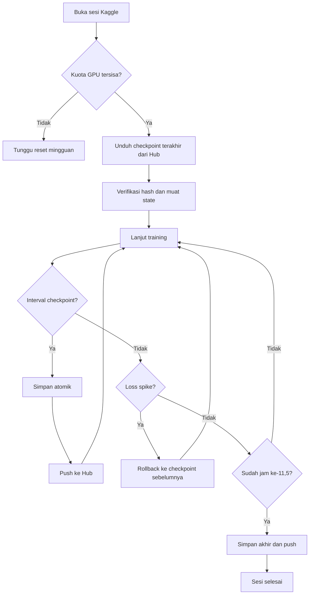
```mermaid
flowchart TD
    A["Buka sesi Kaggle"] --> B{"Kuota GPU tersisa?"}
    B -- "Tidak" --> W["Tunggu reset mingguan"]
    B -- "Ya" --> C["Unduh checkpoint terakhir dari Hub"]
    C --> D["Verifikasi hash dan muat state"]
    D --> E["Lanjut training"]
    E --> F{"Interval checkpoint?"}
    F -- "Ya" --> G["Simpan atomik"]
    G --> H["Push ke Hub"]
    H --> E
    F -- "Tidak" --> I{"Loss spike?"}
    I -- "Ya" --> J["Rollback ke checkpoint sebelumnya"]
    J --> E
    I -- "Tidak" --> K{"Sudah jam ke-11,5?"}
    K -- "Tidak" --> E
    K -- "Ya" --> L["Simpan akhir dan push"]
    L --> M["Sesi selesai"]
```

### 4.3 Alur membuat satu komponen secara manual

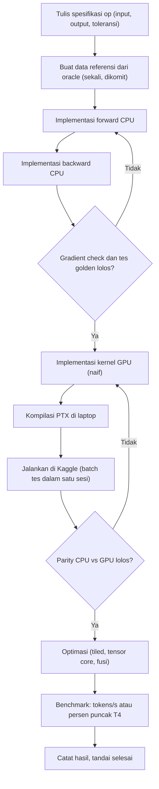
```mermaid
flowchart TD
    A["Tulis spesifikasi op (input, output, toleransi)"] --> B["Buat data referensi dari oracle (sekali, dikomit)"]
    B --> C["Implementasi forward CPU"]
    C --> D["Implementasi backward CPU"]
    D --> E{"Gradient check dan tes golden lolos?"}
    E -- "Tidak" --> C
    E -- "Ya" --> F["Implementasi kernel GPU (naif)"]
    F --> G["Kompilasi PTX di laptop"]
    G --> H["Jalankan di Kaggle (batch tes dalam satu sesi)"]
    H --> I{"Parity CPU vs GPU lolos?"}
    I -- "Tidak" --> F
    I -- "Ya" --> J["Optimasi (tiled, tensor core, fusi)"]
    J --> K["Benchmark: tokens/s atau persen puncak T4"]
    K --> L["Catat hasil, tandai selesai"]
```

### 4.4 Alur eksperimen ablasi

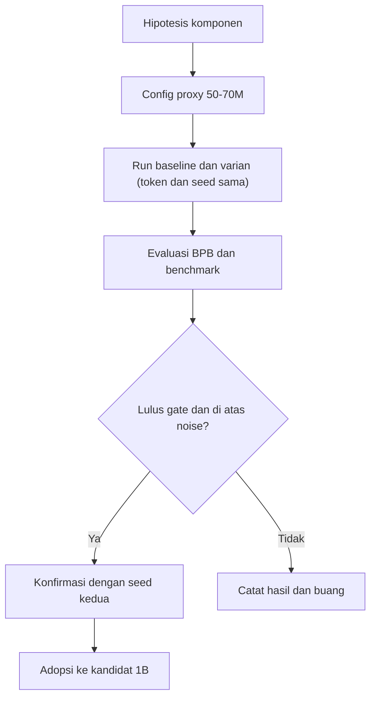
```mermaid
flowchart TD
    A["Hipotesis komponen"] --> B["Config proxy 50-70M"]
    B --> C["Run baseline dan varian (token dan seed sama)"]
    C --> D["Evaluasi BPB dan benchmark"]
    D --> E{"Lulus gate dan di atas noise?"}
    E -- "Ya" --> F["Konfirmasi dengan seed kedua"]
    F --> G["Adopsi ke kandidat 1B"]
    E -- "Tidak" --> H["Catat hasil dan buang"]
```

### 4.5 Alur tahap reasoning

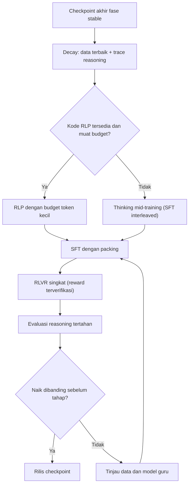
```mermaid
flowchart TD
    A["Checkpoint akhir fase stable"] --> B["Decay: data terbaik + trace reasoning"]
    B --> C{"Kode RLP tersedia dan muat budget?"}
    C -- "Ya" --> D["RLP dengan budget token kecil"]
    C -- "Tidak" --> E["Thinking mid-training (SFT interleaved)"]
    D --> F["SFT dengan packing"]
    E --> F
    F --> G["RLVR singkat (reward terverifikasi)"]
    G --> H["Evaluasi reasoning tertahan"]
    H --> I{"Naik dibanding sebelum tahap?"}
    I -- "Ya" --> J["Rilis checkpoint"]
    I -- "Tidak" --> K["Tinjau data dan model guru"]
    K --> F
```

### 4.6 Alur inferensi multimodal

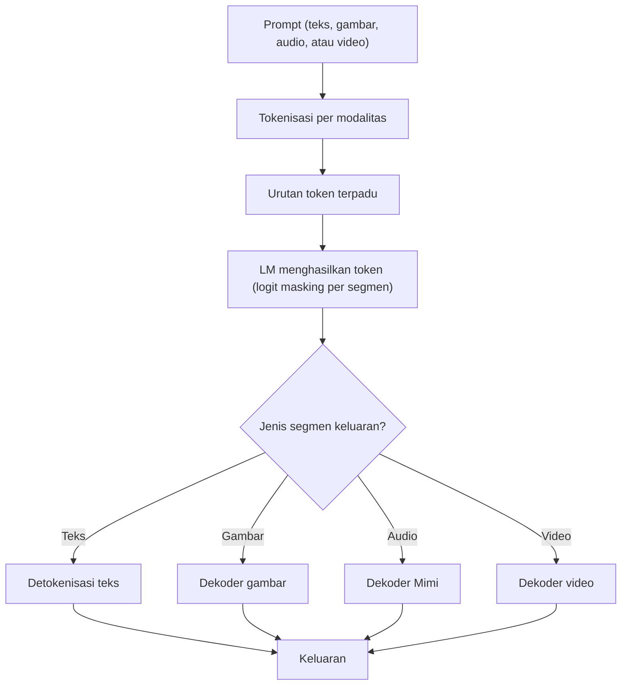
```mermaid
flowchart TD
    A["Prompt (teks, gambar, audio, atau video)"] --> B["Tokenisasi per modalitas"]
    B --> C["Urutan token terpadu"]
    C --> D["LM menghasilkan token (logit masking per segmen)"]
    D --> E{"Jenis segmen keluaran?"}
    E -- "Teks" --> F["Detokenisasi teks"]
    E -- "Gambar" --> G["Dekoder gambar"]
    E -- "Audio" --> H["Dekoder Mimi"]
    E -- "Video" --> I["Dekoder video"]
    F --> J["Keluaran"]
    G --> J
    H --> J
    I --> J
```

### 4.7 Alur kurikulum pelatihan multimodal

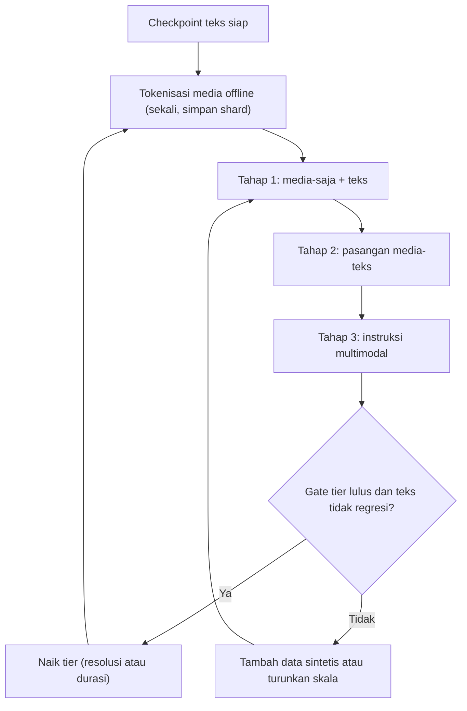
```mermaid
flowchart TD
    A["Checkpoint teks siap"] --> B["Tokenisasi media offline (sekali, simpan shard)"]
    B --> C["Tahap 1: media-saja + teks"]
    C --> D["Tahap 2: pasangan media-teks"]
    D --> E["Tahap 3: instruksi multimodal"]
    E --> F{"Gate tier lulus dan teks tidak regresi?"}
    F -- "Ya" --> G["Naik tier (resolusi atau durasi)"]
    G --> B
    F -- "Tidak" --> H["Tambah data sintetis atau turunkan skala"]
    H --> C
```

### 4.8 Mesin status sesi training

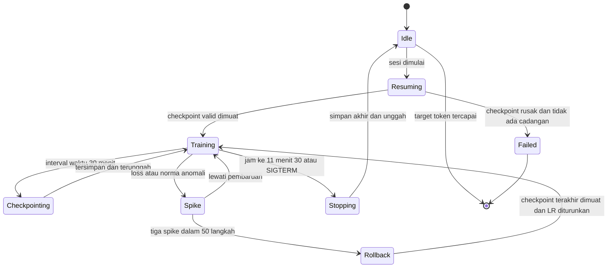
```mermaid
stateDiagram-v2
    [*] --> Idle
    Idle --> Resuming : sesi dimulai
    Resuming --> Training : checkpoint valid dimuat
    Resuming --> Failed : checkpoint rusak dan tidak ada cadangan
    Training --> Checkpointing : interval waktu 30 menit
    Checkpointing --> Training : tersimpan dan terunggah
    Training --> Spike : loss atau norma anomali
    Spike --> Training : lewati pembaruan
    Spike --> Rollback : tiga spike dalam 50 langkah
    Rollback --> Training : checkpoint terakhir dimuat dan LR diturunkan
    Training --> Stopping : jam ke 11 menit 30 atau SIGTERM
    Stopping --> Idle : simpan akhir dan unggah
    Idle --> [*] : target token tercapai
    Failed --> [*]
```

### 4.9 Urutan penulisan checkpoint atomik

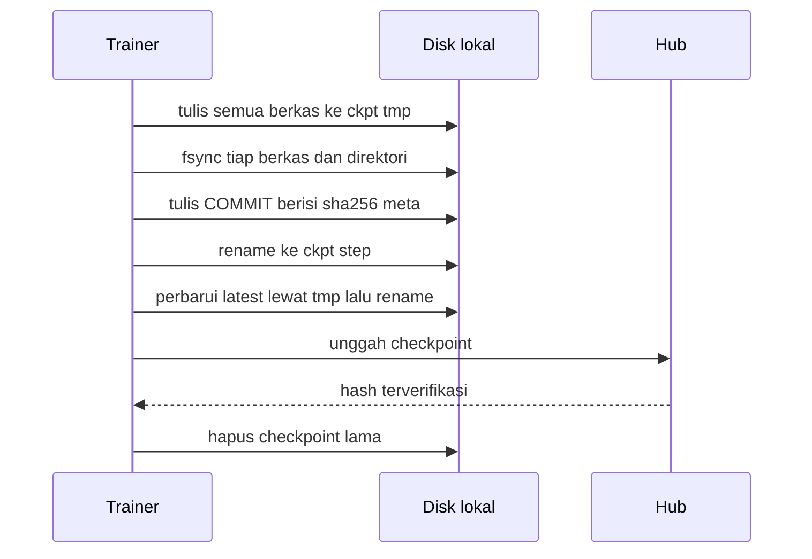
```mermaid
sequenceDiagram
    participant T as Trainer
    participant D as Disk lokal
    participant H as Hub
    T->>D: tulis semua berkas ke ckpt tmp
    T->>D: fsync tiap berkas dan direktori
    T->>D: tulis COMMIT berisi sha256 meta
    T->>D: rename ke ckpt step
    T->>D: perbarui latest lewat tmp lalu rename
    T->>H: unggah checkpoint
    H-->>T: hash terverifikasi
    T->>D: hapus checkpoint lama
```

### 4.10 Urutan satu langkah data-parallel dengan ZeRO-1

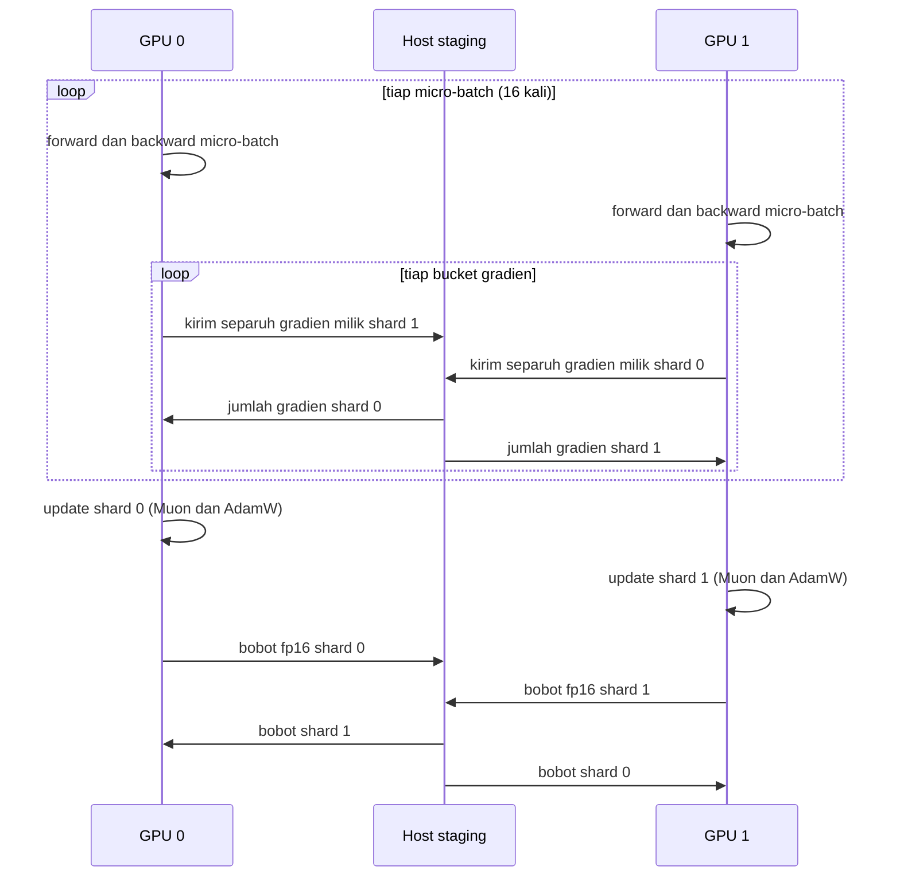
```mermaid
sequenceDiagram
    participant G0 as GPU 0
    participant HS as Host staging
    participant G1 as GPU 1
    loop tiap micro-batch (16 kali)
        G0->>G0: forward dan backward micro-batch
        G1->>G1: forward dan backward micro-batch
        loop tiap bucket gradien
            G0->>HS: kirim separuh gradien milik shard 1
            G1->>HS: kirim separuh gradien milik shard 0
            HS->>G0: jumlah gradien shard 0
            HS->>G1: jumlah gradien shard 1
        end
    end
    G0->>G0: update shard 0 (Muon dan AdamW)
    G1->>G1: update shard 1 (Muon dan AdamW)
    G0->>HS: bobot fp16 shard 0
    G1->>HS: bobot fp16 shard 1
    HS->>G0: bobot shard 1
    HS->>G1: bobot shard 0
```

### 4.11 Alur pipeline data

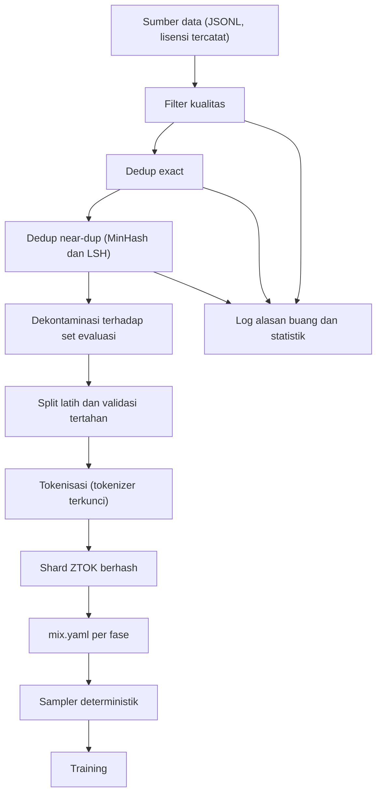
```mermaid
flowchart TD
    A["Sumber data (JSONL, lisensi tercatat)"] --> B["Filter kualitas"]
    B --> C["Dedup exact"]
    C --> D["Dedup near-dup (MinHash dan LSH)"]
    D --> E["Dekontaminasi terhadap set evaluasi"]
    E --> F["Split latih dan validasi tertahan"]
    F --> G["Tokenisasi (tokenizer terkunci)"]
    G --> H["Shard ZTOK berhash"]
    H --> I["mix.yaml per fase"]
    I --> J["Sampler deterministik"]
    J --> K["Training"]
    B --> L["Log alasan buang dan statistik"]
    C --> L
    D --> L
```

### 4.12 Alur CI

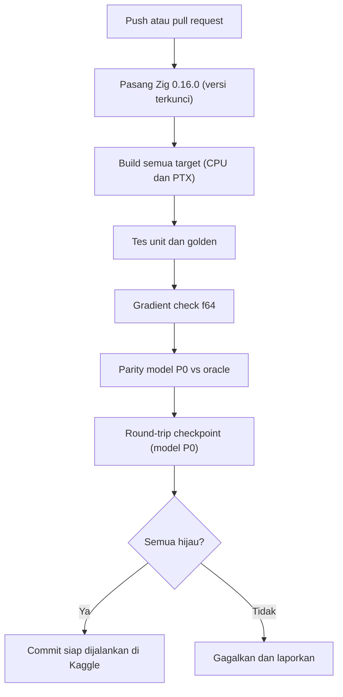
```mermaid
flowchart TD
    A["Push atau pull request"] --> B["Pasang Zig 0.16.0 (versi terkunci)"]
    B --> C["Build semua target (CPU dan PTX)"]
    C --> D["Tes unit dan golden"]
    D --> E["Gradient check f64"]
    E --> F["Parity model P0 vs oracle"]
    F --> G["Round-trip checkpoint (model P0)"]
    G --> H{"Semua hijau?"}
    H -- "Ya" --> I["Commit siap dijalankan di Kaggle"]
    H -- "Tidak" --> J["Gagalkan dan laporkan"]
```

### 4.13 Alur penanganan overflow dan loss spike

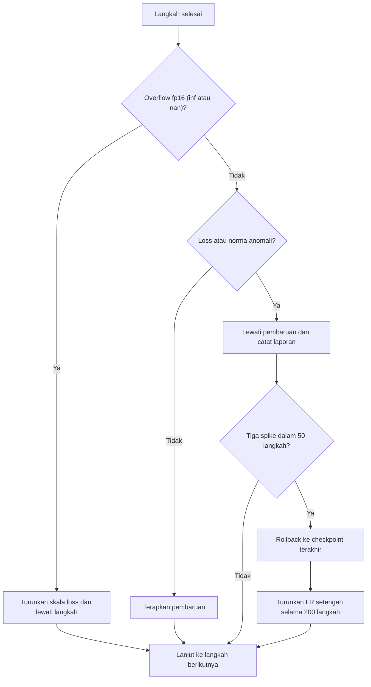
```mermaid
flowchart TD
    A["Langkah selesai"] --> B{"Overflow fp16 (inf atau nan)?"}
    B -- "Ya" --> C["Turunkan skala loss dan lewati langkah"]
    B -- "Tidak" --> D{"Loss atau norma anomali?"}
    D -- "Tidak" --> E["Terapkan pembaruan"]
    D -- "Ya" --> F["Lewati pembaruan dan catat laporan"]
    F --> G{"Tiga spike dalam 50 langkah?"}
    G -- "Tidak" --> H["Lanjut ke langkah berikutnya"]
    G -- "Ya" --> I["Rollback ke checkpoint terakhir"]
    I --> J["Turunkan LR setengah selama 200 langkah"]
    J --> H
    C --> H
    E --> H
```

### 4.14 Alur keputusan G-SCALE (ukuran model dan token budget)

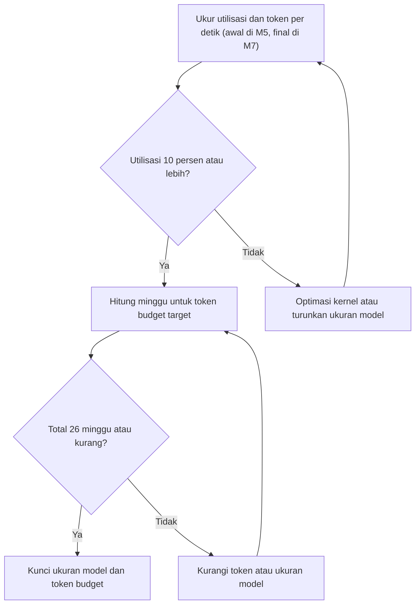
```mermaid
flowchart TD
    A["Ukur utilisasi dan token per detik (awal di M5, final di M7)"] --> B{"Utilisasi 10 persen atau lebih?"}
    B -- "Ya" --> C["Hitung minggu untuk token budget target"]
    B -- "Tidak" --> D["Optimasi kernel atau turunkan ukuran model"]
    D --> A
    C --> E{"Total 26 minggu atau kurang?"}
    E -- "Ya" --> F["Kunci ukuran model dan token budget"]
    E -- "Tidak" --> G["Kurangi token atau ukuran model"]
    G --> C
```

---

## 5. Schema

### 5.1 Skema pelacakan eksperimen

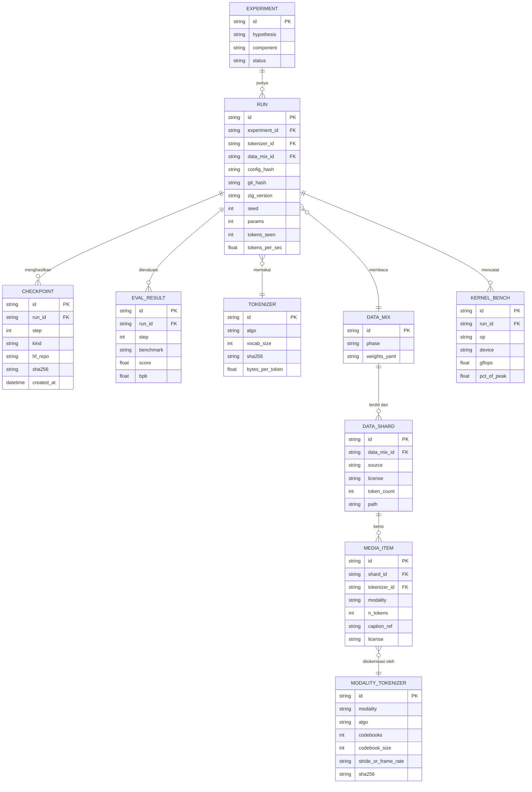
```mermaid
erDiagram
    EXPERIMENT ||--o{ RUN : "punya"
    RUN ||--o{ CHECKPOINT : "menghasilkan"
    RUN ||--o{ EVAL_RESULT : "dievaluasi"
    RUN }o--|| TOKENIZER : "memakai"
    RUN }o--|| DATA_MIX : "membaca"
    DATA_MIX ||--o{ DATA_SHARD : "terdiri dari"
    RUN ||--o{ KERNEL_BENCH : "mencatat"
    DATA_SHARD ||--o{ MEDIA_ITEM : "berisi"
    MEDIA_ITEM }o--|| MODALITY_TOKENIZER : "ditokenisasi oleh"

    EXPERIMENT {
        string id PK
        string hypothesis
        string component
        string status
    }
    RUN {
        string id PK
        string experiment_id FK
        string tokenizer_id FK
        string data_mix_id FK
        string config_hash
        string git_hash
        string zig_version
        int seed
        int params
        int tokens_seen
        float tokens_per_sec
    }
    CHECKPOINT {
        string id PK
        string run_id FK
        int step
        string kind
        string hf_repo
        string sha256
        datetime created_at
    }
    EVAL_RESULT {
        string id PK
        string run_id FK
        int step
        string benchmark
        float score
        float bpb
    }
    KERNEL_BENCH {
        string id PK
        string run_id FK
        string op
        string device
        float gflops
        float pct_of_peak
    }
    TOKENIZER {
        string id PK
        string algo
        int vocab_size
        string sha256
        float bytes_per_token
    }
    DATA_MIX {
        string id PK
        string phase
        string weights_yaml
    }
    DATA_SHARD {
        string id PK
        string data_mix_id FK
        string source
        string license
        int token_count
        string path
    }
    MEDIA_ITEM {
        string id PK
        string shard_id FK
        string tokenizer_id FK
        string modality
        int n_tokens
        string caption_ref
        string license
    }
    MODALITY_TOKENIZER {
        string id PK
        string modality
        string algo
        int codebooks
        int codebook_size
        string stride_or_frame_rate
        string sha256
    }
```

### 5.2 Skema isi checkpoint

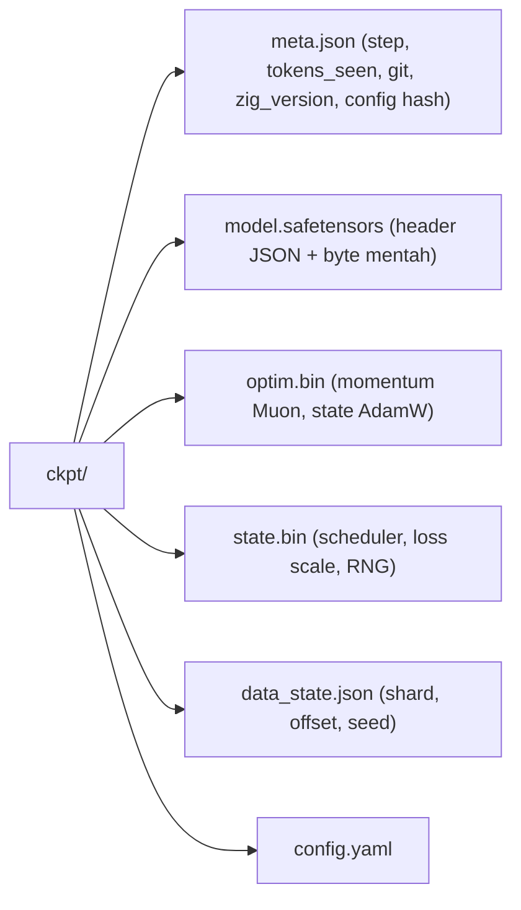
```mermaid
flowchart LR
    R["ckpt/"] --> M["meta.json (step, tokens_seen, git, zig_version, config hash)"]
    R --> W["model.safetensors (header JSON + byte mentah)"]
    R --> O["optim.bin (momentum Muon, state AdamW)"]
    R --> S["state.bin (scheduler, loss scale, RNG)"]
    R --> D["data_state.json (shard, offset, seed)"]
    R --> C["config.yaml"]
```

### 5.3 Skema arsitektur model

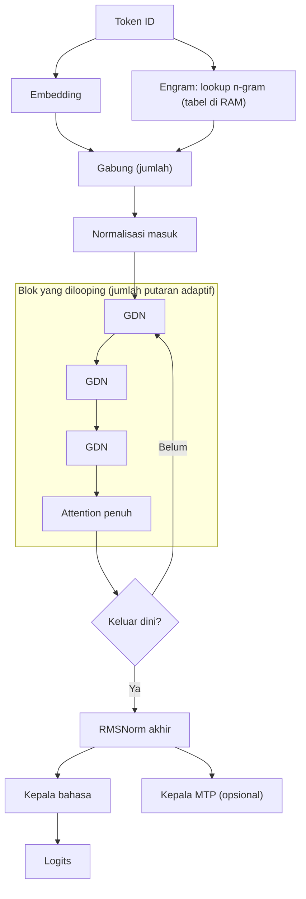
```mermaid
flowchart TD
    A["Token ID"] --> B["Embedding"]
    A --> E["Engram: lookup n-gram (tabel di RAM)"]
    B --> C["Gabung (jumlah)"]
    E --> C
    C --> NIN["Normalisasi masuk"]

    subgraph LOOP["Blok yang dilooping (jumlah putaran adaptif)"]
        direction TB
        H1["GDN"] --> H2["GDN"]
        H2 --> H3["GDN"]
        H3 --> H4["Attention penuh"]
    end

    NIN --> H1
    H4 --> X{"Keluar dini?"}
    X -- "Belum" --> H1
    X -- "Ya" --> N["RMSNorm akhir"]
    N --> LM["Kepala bahasa"]
    N --> MTP["Kepala MTP (opsional)"]
    LM --> OUT["Logits"]
```

### 5.4 Skema modul engine Zig

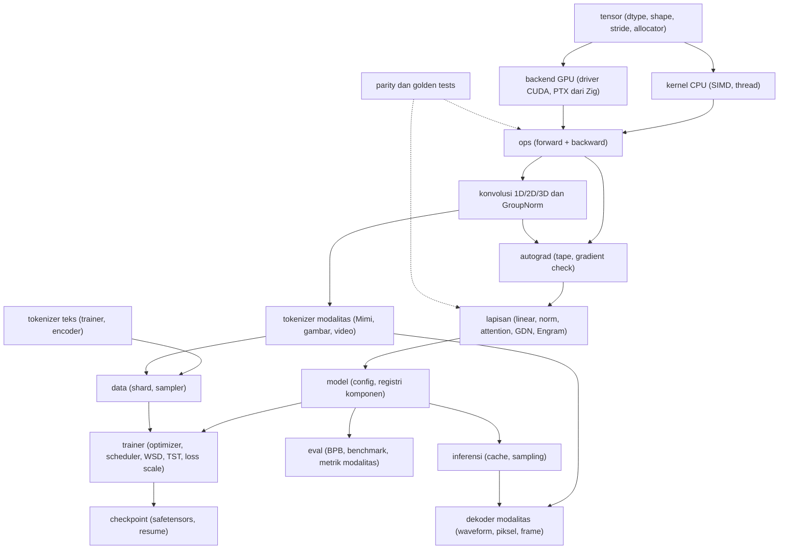
```mermaid
flowchart TD
    T["tensor (dtype, shape, stride, allocator)"] --> K["kernel CPU (SIMD, thread)"]
    T --> G["backend GPU (driver CUDA, PTX dari Zig)"]
    K --> OPS["ops (forward + backward)"]
    G --> OPS
    OPS --> CV["konvolusi 1D/2D/3D dan GroupNorm"]
    OPS --> AG["autograd (tape, gradient check)"]
    CV --> AG
    AG --> L["lapisan (linear, norm, attention, GDN, Engram)"]
    L --> M["model (config, registri komponen)"]
    M --> TR["trainer (optimizer, scheduler, WSD, TST, loss scale)"]
    TR --> CK["checkpoint (safetensors, resume)"]
    D["data (shard, sampler)"] --> TR
    TK["tokenizer teks (trainer, encoder)"] --> D
    CV --> MT["tokenizer modalitas (Mimi, gambar, video)"]
    MT --> D
    MT --> DEC["dekoder modalitas (waveform, piksel, frame)"]
    M --> EV["eval (BPB, benchmark, metrik modalitas)"]
    M --> INF["inferensi (cache, sampling)"]
    INF --> DEC
    PAR["parity dan golden tests"] -.-> OPS
    PAR -.-> L
```

### 5.5 Skema ruang vocab terpadu

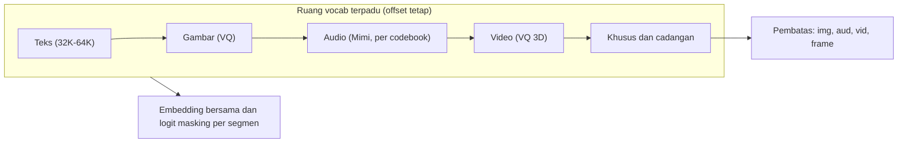
```mermaid
flowchart LR
    subgraph V["Ruang vocab terpadu (offset tetap)"]
        direction LR
        A["Teks (32K-64K)"] --> B["Gambar (VQ)"]
        B --> C["Audio (Mimi, per codebook)"]
        C --> D["Video (VQ 3D)"]
        D --> E["Khusus dan cadangan"]
    end
    E --> F["Pembatas: img, aud, vid, frame"]
    V --> H["Embedding bersama dan logit masking per segmen"]
```

### 5.6 Skema blok Gated DeltaNet

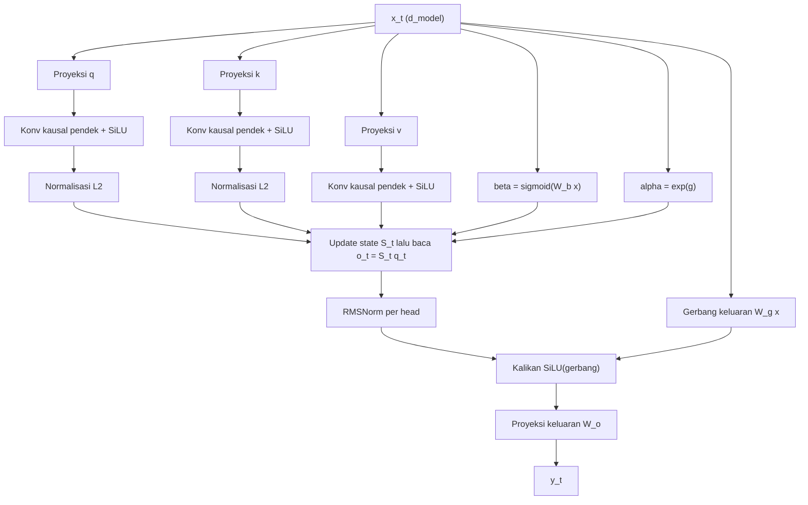
```mermaid
flowchart TD
    X["x_t (d_model)"] --> PQ["Proyeksi q"]
    X --> PK["Proyeksi k"]
    X --> PV["Proyeksi v"]
    X --> PB["beta = sigmoid(W_b x)"]
    X --> PA["alpha = exp(g)"]
    X --> PG["Gerbang keluaran W_g x"]
    PQ --> CQ["Konv kausal pendek + SiLU"]
    PK --> CK["Konv kausal pendek + SiLU"]
    PV --> CV["Konv kausal pendek + SiLU"]
    CQ --> NQ["Normalisasi L2"]
    CK --> NK["Normalisasi L2"]
    NQ --> ST["Update state S_t lalu baca o_t = S_t q_t"]
    NK --> ST
    CV --> ST
    PB --> ST
    PA --> ST
    ST --> RN["RMSNorm per head"]
    RN --> MUL["Kalikan SiLU(gerbang)"]
    PG --> MUL
    MUL --> PO["Proyeksi keluaran W_o"]
    PO --> Y["y_t"]
```

### 5.7 Skema blok Engram

```mermaid
flowchart TD
    T["Id token konteks"] --> C["Kompresi ke id kanonik"]
    C --> N2["n-gram orde 2"]
    C --> N3["n-gram orde 3"]
    N2 --> H2["Hash multi-head (8 head, tabel prima berbeda)"]
    N3 --> H3["Hash multi-head (8 head, tabel prima berbeda)"]
    H2 --> E["Lookup tabel di RAM host (prefetch)"]
    H3 --> E
    E --> CAT["Gabung vektor semua head dan orde"]
    CAT --> PK["Proyeksi key"]
    CAT --> PV["Proyeksi value"]
    HS["Hidden state h"] --> GT["Gerbang g = sigmoid(sign(a) sqrt(max(abs(a), eps)))"]
    PK --> GT
    GT --> GV["Kalikan g dengan value"]
    PV --> GV
    GV --> R["Tambahkan ke residual"]
```

### 5.8 Skema BitLinear (W1.58 A8)

```mermaid
flowchart TD
    X["Aktivasi x"] --> N["RMSNorm (subln)"]
    N --> AQ["Kuantisasi absmax per token ke int8"]
    W["Bobot master fp32"] --> WQ["Absmean per tensor lalu RoundClip ke -1, 0, +1"]
    AQ --> MM["Matmul (mma int8 atau tambah-kurang)"]
    WQ --> MM
    MM --> SC["Kalikan skala (gamma dan skala aktivasi)"]
    SC --> Y["Keluaran"]
    Y -. STE .-> W
```

### 5.9 Skema konfigurasi

```mermaid
classDiagram
    class RunConfig {
        +string run_id
        +int seed
        +string zig_version
        +ModelConfig model
        +TrainConfig train
        +string mix_path
        +string tokenizer_hash
    }
    class ModelConfig {
        +int d_model
        +int n_groups
        +int vocab_size
        +int seq_len
        +AttnConfig attn
        +GdnConfig gdn
        +MlpConfig mlp
        +EngramConfig engram
        +LoopConfig loop
        +BitConfig bit
        +MtpConfig mtp
    }
    class AttnConfig {
        +int n_heads
        +int n_kv_heads
        +int head_dim
        +float rope_theta
    }
    class GdnConfig {
        +int n_key_heads
        +int n_value_heads
        +int key_dim
        +int value_dim
        +int conv_kernel
        +int chunk_size
    }
    class MlpConfig {
        +int hidden
    }
    class EngramConfig {
        +bool enabled
        +list layers
        +list orders
        +int n_heads
        +int table_size
        +int dim_per_head
    }
    class LoopConfig {
        +bool enabled
        +int repeats
        +bool adaptive_exit
    }
    class BitConfig {
        +bool enabled
        +int act_bits
    }
    class MtpConfig {
        +bool enabled
        +float loss_weight
    }
    class TrainConfig {
        +int batch_tokens
        +int micro_batch
        +float lr_muon
        +float lr_adamw
        +float weight_decay
        +int warmup_steps
        +float decay_fraction
        +float tst_fraction
        +int tst_bag
        +float clip_norm
    }
    RunConfig --> ModelConfig
    RunConfig --> TrainConfig
    ModelConfig --> AttnConfig
    ModelConfig --> GdnConfig
    ModelConfig --> MlpConfig
    ModelConfig --> EngramConfig
    ModelConfig --> LoopConfig
    ModelConfig --> BitConfig
    ModelConfig --> MtpConfig
```

### 5.10 Skema berkas shard token (ZTOK)

```mermaid
flowchart LR
    S["Berkas shard .bin"] --> H["Header"]
    S --> D["Token little-endian (u16 atau u32)"]
    H --> H1["magic dan versi"]
    H --> H2["dtype (u16 atau u32)"]
    H --> H3["jumlah token (u64)"]
    H --> H4["ukuran vocab"]
    H --> H5["sha256 tokenizer"]
    D --> D1["dokumen 1 + eos"]
    D --> D2["dokumen 2 + eos"]
    D --> D3["dan seterusnya"]
```

### 5.11 Skema berkas safetensors

```mermaid
flowchart LR
    F["Berkas safetensors"] --> A["8 byte: panjang header (u64 little-endian)"]
    F --> B["Header JSON"]
    F --> C["Data tensor mentah"]
    B --> B1["Per tensor: dtype, shape, data_offsets"]
    B --> B2["__metadata__ (opsional)"]
```

### 5.12 Anggaran memori per GPU (model 1B, ZeRO-1)

```mermaid
pie showData
    title Anggaran memori per GPU (GB, asumsi)
    "Bobot fp16" : 2.14
    "Akumulator gradien fp32 (shard)" : 2.14
    "Master fp32 (shard)" : 2.14
    "Momentum Muon fp32 (shard)" : 1.94
    "State AdamW embedding (shard)" : 0.4
    "Aktivasi batas blok" : 0.81
    "Puncak recompute dan workspace attention" : 1.5
    "Logit per potongan" : 0.4
    "Buffer komunikasi dan workspace kernel" : 1.0
```

---

## 6. Tech Stack

### 6.1 Ringkasan teknologi

| Lapisan | Pilihan | Catatan |
|---|---|---|
| Bahasa utama | Zig 0.16.0 (pin tepat) | Pre-1.0: jangan upgrade di tengah fase; versi tercatat di tiap run |
| Build | `build.zig` + `build.zig.zon` | Satu build untuk CPU, PTX, dan tools; tanpa dependensi ML eksternal |
| Tensor dan CPU | Kode sendiri: `@Vector` SIMD + thread pool statis | Referensi desain: Fucina, zgml |
| GPU | Kernel Zig → PTX (backend NVPTX, target sm_75) + CUDA Driver API | Barrier, shuffle, `mma`, `ldmatrix` lewat inline asm PTX; referensi: zig_cuda |
| Presisi | fp16 + loss scaling dinamis, master fp32 | T4 tanpa bf16 |
| Multi-GPU | Data-parallel + ZeRO-1 buatan sendiri (reduce-scatter per bucket, all-gather; salin via host) | Tanpa NCCL; P2P dan overlap menyusul |
| Optimizer | AdamW + Muon (Newton–Schulz), ditulis sendiri | Uji stabilitas fp16; cadangan fp32 |
| Hyperparameter | muP / CompleteP | Sapuan di proxy P2 |
| Arsitektur | Hybrid GDN + attention GQA, Engram, BitLinear, looping, MTP | Semua modular lewat config |
| Tokenizer | Trainer dan encoder SuperBPE/BPE di Zig | Pembanding: Gigatoken, HF tokenizers |
| Data | JSONL → shard ZTOK memmap | `uint16`/`uint32` sesuai vocab |
| Checkpoint | safetensors ditulis manual + biner sendiri untuk state | Protokol atomik; cadangan ke Hugging Face Hub lewat CLI |
| Evaluasi | Runner BPB dan log-likelihood di Zig | Divalidasi sekali terhadap harness standar |
| Oracle tes | PyTorch (hanya membuat data referensi) | Tidak ikut produk |
| Orkestrasi | Shell + Kaggle CLI + YAML | Kode non-Zig di jalur produk, bersama skrip glue media |
| CI | GitHub Actions (CPU) | Build, golden, gradient check, parity P0, round-trip checkpoint |
| Observabilitas | Logger JSONL + `diff_ops` + dashboard opsional | Config, hash, versi Zig tiap run |
| Inferensi | Engine Zig forward-only; bitnet.cpp sebagai pembanding bila ternary | Ukur token/detik di CPU dan T4 |
| Konvolusi | Op conv1d/2d/3d sendiri (im2col dulu, lalu kernel langsung) | Dibutuhkan semua codec/tokenizer modalitas |
| Audio | Codec Mimi (bobot CC-BY, khusus ucapan), encoder dan dekoder diport ke Zig | Musik/suara umum butuh codec lain |
| Gambar | Tokenizer VQ pretrained berlisensi jelas (diport ke Zig) atau VQ-VAE kecil sendiri | Cadangan: DiT/flow matching dengan patch masking |
| Video | VQ 3D kausal berkompresi tinggi (gaya MagViT-v2/LTX), tier kecil | Dekoder diport ke Zig |
| Media → tensor | Skrip glue (ffmpeg, decoder gambar) | Satu-satunya kode non-Zig tambahan di pipeline data |
| Metrik modalitas | PSNR/SSIM, SI-SDR, WER via ASR sendiri, classifier kecil buatan sendiri | FID/FVD/CLIP butuh jaringan pretrained, bukan jalur kritis |

### 6.2 Struktur repositori

```text
repo/
├── build.zig
├── build.zig.zon              # pin Zig 0.16.0; tanpa dependensi ML
├── src/
│   ├── tensor/                # Tensor, dtype, alokator, view
│   ├── cpu/                   # kernel CPU: matmul, elementwise, reduksi, konv
│   ├── gpu/                   # binding CUDA Driver API, alokator device, launcher
│   ├── kernels/               # kernel Zig menjadi PTX (sm_75)
│   ├── autograd/              # tape, backward, gradient check
│   ├── nn/                    # linear, norm, rope, attention, gdn, engram, bitlinear, mlp
│   ├── model/                 # config, registri komponen, param_count
│   ├── optim/                 # adamw, muon, jadwal WSD, loss scaler
│   ├── train/                 # loop, dp/zero1, checkpoint, watchdog, spike
│   ├── tokenizer/             # pra-tokenizer, trainer bpe/superbpe, encoder, decoder
│   ├── data/                  # filter, dedup, shard, mix, sampler
│   ├── eval/                  # bpb, runner benchmark, metrik modalitas
│   ├── infer/                 # forward-only, cache, sampling, ternary
│   ├── modality/              # mimi, vq gambar, vq video, dekoder
│   └── tools/                 # diff_ops, dump tensor, param_count, gradcheck CLI
├── tests/
│   └── golden/                # biner referensi dari oracle (dikomit)
├── oracle/                    # skrip PyTorch pembuat data referensi (bukan produk)
├── scripts/                   # shell: kaggle, hub sync, glue media
├── configs/                   # model/*.yaml, mix/*.yaml, run/*.yaml
└── docs/                      # PRD.md, catatan eksperimen
```

### 6.3 Kontrak modul (pseudokode)

Bentuk kontrak, bukan kode final. Sintaks dan API `std` berubah antar versi Zig, jadi cek terhadap 0.16.0.

```zig
pub const DType = enum { f32, f16, i8, u8, i32, u16, u32, ternary2 };
pub const Device = enum { cpu, gpu };

pub const Tensor = struct {
    data: [*]u8,
    dtype: DType,
    device: Device,
    ndim: u8,
    shape: [5]usize,
    strides: [5]usize, // dalam elemen
    offset: usize,
    owns: bool,
};

pub const Op = struct {
    name: []const u8,
    forward: *const fn (ctx: *Ctx, ins: []const Tensor, out: *Tensor) void,
    backward: *const fn (ctx: *Ctx, ins: []const Tensor, out: Tensor, gout: Tensor, gins: []Tensor) void,
};

pub const Checkpoint = struct {
    pub fn save(dir: []const u8, state: *TrainState) !void {} // atomik, lihat 3.4
    pub fn load(dir: []const u8, state: *TrainState) !void {} // menolak tanpa COMMIT atau hash valid
};
```

Aturan kontrak:
- Tidak ada alokasi tersembunyi: setiap fungsi yang mengalokasi menerima allocator eksplisit.
- Op generik atas tipe float (`comptime T`) agar bisa dites di f64.
- Setiap op: forward, backward, tes golden, gradient check, benchmark.
- Kesalahan lewat error union Zig; tidak ada `unreachable` di jalur data pengguna.

### 6.4 Lingkungan Kaggle (daftar periksa sesi)

1. Aktifkan akselerator GPU T4 ×2 dan akses internet pada notebook.
2. Unduh tarball Zig 0.16.0 dan verifikasi sha256 sebelum dipasang.
3. Periksa `nvidia-smi`, keberadaan `libcuda.so`, dan versi driver; catat ke `meta.json`.
4. Query properti GPU (jumlah SM, memori, kemampuan komputasi) lewat Driver API dan bandingkan dengan 1.4.
5. Set direktori cache JIT PTX agar kompilasi tidak diulang tiap sesi.
6. Muat token Hugging Face dari Kaggle Secrets (jangan ditulis di repositori).
7. Jalankan suite tes parity GPU singkat; lanjutkan hanya bila lulus.
8. Jalankan skrip resume; aktifkan watchdog (11 jam 30 menit).

### 6.5 Konvensi

- **Penamaan:** modul huruf kecil bergaris bawah; tipe PascalCase; fungsi camelCase (gaya Zig).
- **Tes:** satu berkas tes per modul; tes golden memakai biner di `tests/golden/`.
- **Commit:** pesan mengikuti ID tasklist (mis. `T3.3-05: matmul tensor core`).
- **Eksperimen:** satu catatan per ablasi (hipotesis, config, hasil, keputusan) di `docs/`.
- **Versi:** hash git, versi Zig, dan hash config disimpan di tiap checkpoint dan log.
